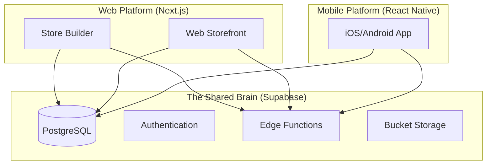

# Baci Platform Architecture: The "Shared Brain"

## Overview

Baci is designed as a unified platform where a merchant's business logic, data, and brand identity are centralized. This "Shared Brain" architecture ensures that the Web Storefront and Mobile App act as synchronized projections of the same core business.

## Core Components

## 1. Single Source of Truth (Database)

All critical data resides in Supabase (PostgreSQL):
*   **Merchants:** Business profile, subscription status.
*   **Catalog:** Products, inventory, categories.
*   **Commerce:** Orders, customers, carts.
*   **Branding:** Colors, logos, theme preferences.

**Rule:** Neither the Web nor Mobile app stores "master" data locally. They fetch from and sync to Supabase.

## 2. Shared Business Logic (Edge Functions)

Complex commerce logic is **NEVER** duplicated in client code. It lives in Supabase Edge Functions.

### Key Functions:
*   **`calculate-commerce`**: The most critical function. It takes a cart and merchant ID, and returns the final totals including:
    *   VAT/Tax calculations
    *   Delivery fees
    *   Platform commissions
    *   Discounts/Coupons
*   **`process-order`**: Handles the transition from Cart to Order, inventory deduction, and payment verification.

**Benefit:** If we change the tax logic, both the Web Store and Mobile App are updated instantly without an app store release.

## 3. Synchronized State (TanStack Query)

Both platforms use **TanStack Query** (React Query) to manage server state.
*   **Stale-While-Revalidate:** Data is shown instantly from cache while fetching fresh data.
*   **Real-time:** Both apps listen to Supabase `postgres_changes` to auto-update (e.g., if an order status changes on the web dashboard, the mobile app notification triggers instantly).

## 4. Unified Design System

*   **Design Tokens:** We use a shared set of design tokens (colors, spacing, typography).
*   **Theming:** 
    *   **Web:** CSS Variables (`--store-primary`) injected at runtime.
    *   **Mobile:** React Context/Zustand store that fetches the same color hex codes from the merchant profile and applies them to native components.

## 5. AI Integration

AI operations (Logo generation, Description writing) are performed on the server (Web Platform) via **Google Genkit**.
*   The Mobile App generally *consumes* the output of AI (e.g., displaying the generated description) rather than triggering generation flows, though this may change in future versions.
