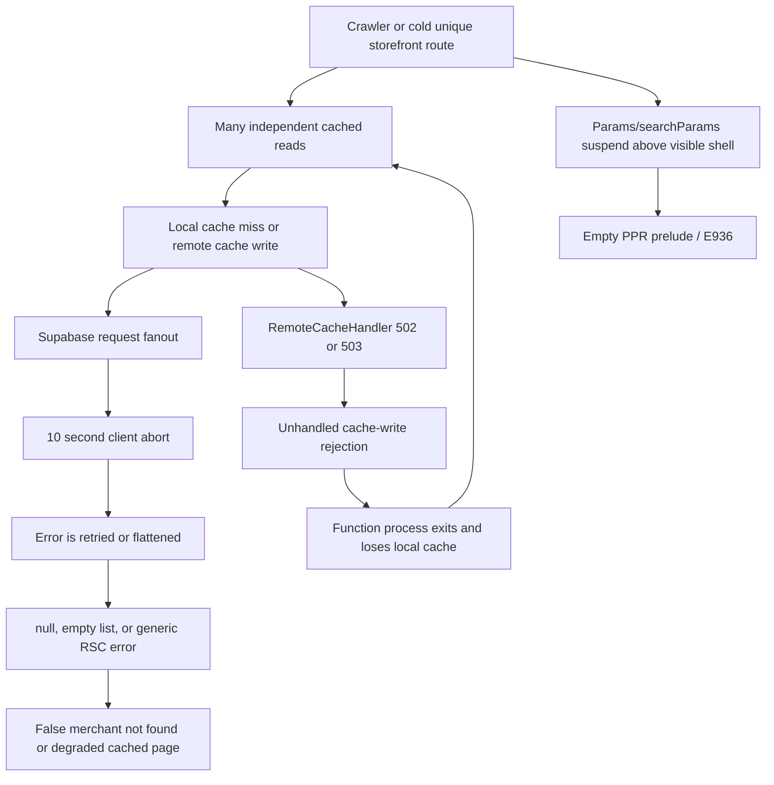

# Storefront Runtime Reliability Plan (2026-07-09)

**Status:** Approved for implementation
**Owner:** Codex, acting under the repository's performance/SEO rules
**Baseline:** `origin/main` at `66bd0a45357cc23a93b4594f3cc3960190de8e06`
**Scope:** Public storefront HTML, merchant resolution, PDP/category/blog read paths,
Cache Components/PPR, Vercel remote cache failures, and malformed-path rejection
**Protected-file approval:** The user explicitly approved the planned
`apps/web/src/proxy.ts` change by replying “proceed” after that requirement was
called out. The proxy change remains isolated in its own PR.

## 1. Objective

Permanently remove the feedback loop that currently turns cold or crawler-heavy
storefront traffic into:

- Supabase transport timeouts and excessive request fanout;
- false “merchant not found” outcomes;
- cached empty/degraded product and blog data;
- `NEXT_STATIC_GEN_BAILOUT` / missing PPR static shells;
- fatal `RemoteCacheHandler` write rejections; and
- malformed, over-encoded paths reaching tenant lookup and rendering.

This is an architectural repair, not a log-suppression exercise. Success means a
public route has one bounded data contract, explicit availability semantics, an
invariant HTML shell, and a failure mode that never lies to crawlers or caches.

## 2. Non-negotiable invariants

### SEO and crawlability

1. A valid PDP/category/blog URL emits route-specific `<title>`, description,
   canonical, robots, and structured data in server HTML for Googlebot.
2. A transient origin failure is never converted into a cacheable 404, generic
   merchant page, or successful empty catalog.
3. Canonical redirects and genuine 404s are decided before streaming where an
   HTTP status matters.
4. Bot-specific dynamic rendering is not introduced. Google recommends SSR,
   static rendering, or hydration instead of dynamic rendering as a long-term
   solution.

### Core Web Vitals

1. The human static shell retains visible storefront chrome; no global
   `fallback={null}` may hide it.
2. The first-viewport/LCP image keeps stable dimensions and early discovery.
3. The repair must not increase CLS above `0.1` or regress p75 LCP beyond the
   pre-change variance. The target remains LCP `< 2.5s`.
4. No extra client JavaScript is added to repair server data or routing.

### Reliability and data truth

1. Read paths distinguish `found`, `not_found`, and `unavailable`.
2. Only `not_found` may become a durable negative cache entry or 404.
3. A transient database/cache/transport failure must escape every cache scope;
   it must never be normalized to `null`, `{}`, or `[]` inside a cached function.
4. Route-critical reads are bounded by row count, selected columns, and query
   count.
5. The application does not stack manual retries on Supabase's built-in
   PostgREST retries without measured justification.
6. A cache backend failure cannot terminate a successful storefront process.

### Change control

1. No blanket `connection()` additions. Use it only for work that is genuinely
   request-time and already lives below a visible Suspense boundary.
2. Supabase migrations are append-only and tested in a transaction before
   application.
3. `proxy.ts` changes are isolated, security/routing tested, and use the approval
   recorded above.
4. Do not run a Vercel cloud build. Production continues through the VPS
   prebuilt deployment flow after merge.

## 3. Confirmed production evidence

The evidence window was captured on 2026-07-09 against deployment
`dpl_2buF1XdawCku87NdLcp8sDh64SF4`, which contains current `origin/main`.

| Signal | Current evidence | Interpretation |
| --- | ---: | --- |
| PostHog Supabase/storefront timeout issue | At least 317 occurrences in 48h; a newer sample arrived 20:06 UTC | Active after PR #2990 |
| Merchant resolver issue | 70 occurrences in 48h in the primary fingerprint | Active and semantically collapsing failures |
| Vercel timeout traces | 52 unique traces in the refreshed three-hour query | Mostly HTTP 200, proving degraded-success semantics |
| Fatal remote-cache traces | 19 in the refreshed three-hour query | All reached HTTP 200, then Node exited 128 |
| Confirmed static-shell failures | 3 current-deploy PDP routes | Independent PPR tree-shape failure exists |
| Googlebot smoke test | Correct route-specific PDP metadata on a warm live URL | Failure is intermittent/cold-path, not universally generic metadata |

Supabase itself was healthy during the investigation:

- PostgreSQL 17.6; no restart, conflict, or deadlock evidence;
- merchant resolver execution about 11 ms in live `EXPLAIN ANALYZE`;
- long-term means below 2 ms for merchant/variant wrappers and about 15 ms for
  the PDP preflight RPC; and
- a short API-log sample showed about 100 successful calls in about six seconds,
  confirming request fanout rather than one intrinsically slow SQL statement.

The public Supabase and Vercel status pages did not report a matching platform
outage. Platform support may still be needed for the observed per-project remote
cache 502/503 responses, but an application-side fanout/cache redesign is required
regardless.

PRs #2971, #2979, and #2980 already removed the old self-fetching internal
preflight loop and hardened its error classification. Their migrated surfaces are
not being reverted or reimplemented here. The current failures occur on direct
merchant/product/category/blog data and cache paths after those merges.

## 4. Root-cause model



### 4.1 Fanout and broad payloads

`getPublishedClusterPosts(merchantId)` currently loads every published post for a
merchant under `'use cache: remote'`, then downstream callers filter it. Ogabassey
has 526 published posts and the selected JSON payload is about 431 KB. This is
below Vercel's 2 MB item maximum, but it is an unbounded, route-critical payload
with poor write economics under crawler traffic.

PDP rendering also composes merchant, product, variants, serialized availability,
SEO inventory, and guide/blog reads through separate calls. Individual SQL is
fast; the tail is caused by the number of transport/cache operations per cold
render.

The canonical categorized PDP currently performs an LCP/product projection and
then starts the full product-details path, each of which can hydrate variants and
discover serialized-inventory policy. Live cumulative statement counts for the
LCP projection, variant RPC, policy lookup, and full PDP projection are all in the
hundreds of thousands and close enough to confirm systemic duplicate hydration.
The target PDP core snapshot must replace both phases, not merely cache them more.

### 4.2 Error-semantic collapse

`getMerchantSafe()` retries the cached lookup, may perform another direct lookup,
and ultimately returns `null`. Supabase JS 2.108.2 already retries transient
PostgREST errors by default. The application therefore amplifies a transport
brownout and then maps failure to absence.

The installed PostgREST client can retry an idempotent read three times with
1/2/4-second backoff. Because the current custom fetch creates a new ten-second
timeout for every attempt and replaces any parent signal, one logical GET can
approach 47 seconds before the application's own retry/fallback layer starts.
This violates the intended single total deadline.

Product and blog cached functions contain similar patterns: log the error and
return `null`, `{}`, or `[]`. Once the outer cached render completes, transient
failure can persist as a valid-looking empty result.

### 4.3 PPR shell shape

The storefront layout resolves `use(props.params)` inside
`StorefrontLayoutShell`, but the component itself is wrapped by an outer
`<Suspense fallback={null}>`. When params suspend during prerender, the visible
`StorefrontPprStaticShell` sibling is never reached. The documented visible
fallback therefore exists in code but is absent from the generated prelude.

The categorized PDP page also awaits `searchParams` and performs route/data work
in the page root before returning its content boundary. That makes shell output
dependent on request-time work and contributes a second, route-specific shell
failure mode.

### 4.4 Remote-cache process failure

Production shows a Next/Vercel cache-handler 502/503 turning into an unhandled
cache-write rejection after a route has otherwise returned 200, followed by exit
128. Application code cannot make Vercel's handler reliable. It can stop making
route correctness depend on high-cardinality/broad remote writes and provide a
minimal reproducible case to Vercel.

The current trace matches the still-unfixed framework failure described in
<https://github.com/vercel/next.js/issues/94751>: a managed remote-cache write
rejection becomes an unhandled rejection and exit 128. That issue was auto-closed
for lacking a public reproduction, not because a fix shipped.

### 4.5 Malformed paths continue after classification

PRs #2923/#2930 correctly classify unsafe product/category paths, but the route
still performs merchant validation before returning not-found content. A sampled
over-encoded request logged the safety skip, timed out in merchant resolution,
and still returned 200. Rejection must happen before tenant lookup, cache keys,
preflight RPCs, or PPR.

## 5. Current-document decisions

The implementation follows the current official documentation, not Context7:

- Next Cache Components requires request APIs such as `searchParams` below a
  Suspense boundary; the fallback is part of the static shell.
- Use `connection()` only to intentionally defer code that otherwise has no
  request API. It is not a substitute for correct component boundaries.
- Next recommends avoiding `'use cache: remote'` for already-fast operations
  (under about 50 ms), high-cardinality keys, and frequently changing data.
- Supabase JS >= 2.102 enables PostgREST retries by default and warns that excess
  retries can exhaust Data API capacity.
- Supabase returns `{ data, error }`; branch on stable SQLSTATE/PostgREST codes,
  not redacted messages.
- Google says dynamic rendering is a workaround, not a recommended long-term
  indexing strategy.

References:

- <https://nextjs.org/docs/app/getting-started/partial-prerendering>
- <https://nextjs.org/docs/app/api-reference/directives/use-cache-remote>
- <https://nextjs.org/docs/app/api-reference/config/next-config-js/cacheHandlers>
- <https://supabase.com/docs/guides/api/automatic-retries-in-supabase-js>
- <https://supabase.com/docs/guides/api/handling-errors-in-supabase-js>
- <https://vercel.com/docs/functions/functions-api-reference/vercel-functions-package>
- <https://developers.google.com/search/docs/crawling-indexing/javascript/dynamic-rendering>

Next 16.2.10 only republishes a missing SWC-WASM package; it contains no PPR or
remote-cache fix. The program therefore stays on the repository's patched 16.2.9
baseline until a separately validated framework release contains the required
upstream fixes.

## 6. Target architecture

### 6.1 Bounded public read models

Replace route-time composition of many public queries with bounded, public-safe
RPC/view contracts. Proposed contracts (names may be adjusted to match generated
database types):

```sql
resolve_storefront_public_snapshot_v2(p_identifier text)
  -> one row containing merchant shell projection, public feature flags,
     primary domain, routing inputs, and an explicit resolution status

get_storefront_pdp_core_v2(
  p_merchant_id uuid,
  p_product_slug text,
  p_branch_id uuid default null
)
  -> one product row containing canonical category, bounded variants/offers,
     serialized public availability, and fields needed by metadata/critical UI

get_storefront_pdp_enrichment_v2(
  p_merchant_id uuid,
  p_product_id uuid,
  p_category_id uuid,
  p_brand text,
  p_limit integer
)
  -> relevance-ranked, published, indexable guide rows limited in SQL
```

Rules:

- select only public columns;
- pin `search_path` for any `SECURITY DEFINER` function;
- retain RLS or explicitly constrain/grant the public wrapper;
- enforce deterministic ordering and hard row limits;
- use canonical category membership, including child scope only when required;
- keep the current product independently of enrichment caps;
- preserve joined canonical category slugs;
- include public serialized availability in the PDP snapshot so a separate
  summary RPC is unnecessary on the critical path;
- prove every plan with `EXPLAIN (ANALYZE, BUFFERS)` on representative IDs; and
- add indexes only when the measured plan needs them.

Additional integrity/type requirements:

- use the merchant snapshot for both slug and domain resolution; do not retain a
  three-query slug path beside a single-RPC domain path;
- repair live execute grants for `resolve_storefront_cached_merchant(text)` (the
  migration grants service-role only, while production currently grants anon and
  authenticated too);
- audit and safely consolidate the three currently duplicated normalized active
  domain values before adding a partial unique normalized-domain index;
- classify any ambiguous domain as `unavailable/integrity`, never `not_found`; and
- generate current Supabase database types and use them for the new RPC adapters.
  The existing `apps/web/src/types/supabase.ts` is empty, so current assertions do
  not protect selected columns, nullability, or RPC signatures from schema drift.

### 6.2 Explicit lookup results

At the TypeScript boundary, route-critical loaders return a discriminated union:

```ts
type StorefrontReadResult<T> =
  | { status: 'found'; value: T }
  | { status: 'not_found' }
  | { status: 'unavailable'; error: StorefrontReadFailure };
```

The database need not fabricate an `unavailable` row; transport/query failures
are converted to `unavailable` in the data-access adapter. Cacheable functions
may return only `found` or genuine `not_found`. `unavailable` throws a typed error
before a cache entry can be committed.

Route mapping:

| Result | Public response behavior |
| --- | --- |
| `found` | Render/cache normally |
| `not_found` | Real 404 or canonical redirect, depending on route contract |
| `unavailable` before headers | 503, `Cache-Control: private, no-store`, retryable error UI |
| `unavailable` after shell started | Preserve shell, fail the dynamic boundary, capture typed telemetry; never show “not found” |

### 6.3 One deadline and one retry owner

- Preserve a caller-provided `AbortSignal` with `AbortSignal.any()`.
- Set one measured total route/read-model deadline rather than creating a fresh
  ten-second signal for every retry attempt or replacing the caller signal.
- Let Supabase own its default retry policy for idempotent PostgREST reads.
- Remove the second same-cache retry and direct-query retry from
  `getMerchantSafe()` unless metrics prove a distinct recovery source.
- Record structured fields: operation, SQLSTATE/PostgREST code, attempt owner,
  elapsed time, route surface, deployment, and whether headers were sent.

### 6.4 PPR tree invariant

The shell must exist before request-bound params are read:

```tsx
export default function StorefrontLayout(props: LayoutProps) {
  return (
    <StorefrontStaticShell fallback={/* visible, dimensionally stable chrome */}>
      <Suspense fallback={null}>
        <RequestBoundStorefrontLayout {...props} />
      </Suspense>
    </StorefrontStaticShell>
  );
}
```

The exact DOM must avoid duplicate visible chrome after resume (CSS/state must
switch atomically), but the outer static shell cannot depend on `use(params)`.
Fallback appearance must be static/neutral or derived from build-known route
samples, never from a request promise above the shell.

For PDPs:

- keep canonical/not-found resolution before streaming when it can be resolved
  from bounded cached route data;
- pass unresolved `searchParams` into a child below Suspense;
- render a base-product critical image in the shell with stable dimensions;
- resolve variant-query selection in the request child; and
- redirect invalid variant selections before streaming where an HTTP redirect is
  required (prefer Proxy only for path/query rules that do not require product
  data; otherwise use a bounded pre-render route decision).

Next's matching E936 report remains open:
<https://github.com/vercel/next.js/issues/86664>. Therefore the implementation
must both repair Baci's invalid shell shape and preserve a minimal reproduction
if E936 survives with a documented tree.

The current broad OgaBassey `connection()` in `[slug]/layout.tsx` was introduced
as a hydration workaround. Remove it only in the same PR that restores the
conventional shell boundary and re-proves hydration; do not remove it separately
and do not move it to another broad layout. Retain `patches/next@16.2.9.patch` and
the blocking Googlebot metadata/cache bucket until an installed release contains
the upstream resume fix.

### 6.5 Cache policy

| Data | Policy | Reason |
| --- | --- | --- |
| Static/build-known shell content | `use cache` | Include in shell; no remote write needed |
| Fast bounded merchant/PDP RPC | Direct or short local `use cache` | SQL is already fast; prevent remote backend from becoming route-critical |
| Frequently changing stock/serialized availability | Live bounded read or deliberately short shared cache with proven invalidation | Avoid stale availability across instances |
| Merchant-wide full blog corpus | Remove | Unbounded payload and filtering after fetch |
| Bounded guide candidates | SQL-ranked and limited; cache only if hit ratio and invalidation are proven | Low cardinality and bounded size |
| Transient failures | Never cached | Correctness invariant |

If cross-instance freshness requires shared storage, use one explicitly owned
cache layer with observable get/set errors and reliable invalidation. Do not nest
route correctness inside an opaque remote component write whose rejection can
terminate the process.

### 6.6 Malformed-path terminal guard

In the isolated proxy PR, reject unsafe path segments before tenant routing:

- decode at most a fixed number of times using a total, exception-safe parser;
- cap raw pathname length, decoded segment length, and encoding expansion ratio;
- reject invalid percent encoding and control characters;
- return 400 for malformed encoding and 414 for excessive length;
- set `Cache-Control: private, no-store` and a bounded diagnostic reason;
- do not call merchant lookup, Supabase, preflight, or storefront rewrite; and
- preserve all valid Unicode and canonical legacy redirects.

This guard applies only to request-path safety. It must not reserve valid merchant
slugs or alter auth/API routing.

## 7. Sequential PR plan

Each PR begins from the latest `origin/main`, has a non-overlapping worktree, and
must be production-observable independently.

### PR 1 — Remove the confirmed remote-cache fanout

The dominant current exits are comparison routes writing two remote entries: a
merchant-wide cluster-post result and merchant/category semantic inventory. The
merchant-only key has failed repeatedly with 502/503; a merchant/category key has
also failed. Remove these known triggers before undertaking broader migrations.

1. Add a Next 16.2.9 integration fixture whose remote handler rejects `set()`
   with 502/503/timeout, proving why caller `try/catch` cannot contain it.
2. Add append-only, indexed, bounded guide and semantic-inventory read models.
3. Replace `getPublishedClusterPosts()` on compare/category/PDP paths with
   category/brand/product-aware SQL ranking and deterministic limits.
4. Replace route-critical semantic-inventory and category-shell remote writes
   with bounded direct/request-deduplicated reads.
5. Throw on transient failures; apply optional enrichment fallback only outside
   every cacheable scope.
6. Add a 100-unique-route comparison concurrency harness and payload/query-count
   budgets.

Acceptance:

- no route fetches the full merchant blog corpus;
- comparison routes perform no Vercel remote write for guide/inventory/category
  data;
- injected enrichment failure is not cached and cannot remove core content;
- SQL p95 remains comfortably below the client deadline; and
- Googlebot links/metadata and browser CWV remain unchanged or better.

### PR 2 — Read-model and result-semantics foundation

1. Add failing tests for transient error versus true absence.
2. Add bounded merchant and PDP snapshot RPCs plus any measured indexes.
3. Generate current Supabase types and add typed adapters plus
   `StorefrontReadResult`.
4. Remove duplicate application retry ownership on migrated paths.
5. Ensure all transient failures escape local and remote cache scopes.
6. Unify slug/domain resolution, correct resolver grants, classify ambiguous
   domains, and clean duplicates before enforcing normalized uniqueness.
7. Migrate the merchant shell, PDP, category, and remaining blog callers.
8. Delete obsolete fanout helpers only after every caller is migrated.

Acceptance:

- no false `null`/404 on injected 57014, PGRST003, 503, network abort, or cache
  error;
- a cold representative PDP uses no more than three Data API calls, targeting
  one route snapshot plus optional non-critical enrichment;
- canonical/current-product/category membership behavior is retained; and
- product/blog cached functions cannot persist transient absence.

### PR 3 — PPR/static-shell architecture

1. Add a test/repro that fails when prerender produces an empty prelude.
2. Move the visible static shell outside all request-param suspension.
3. Remove the broad layout `connection()` in the same atomic change and prove no
   hydration regression.
4. Move categorized PDP `searchParams` work below a boundary without weakening
   HTTP redirect/404 behavior.
5. Verify browser and blocking-bot metadata/shell trees while retaining the
   current Next patch and bot cache partition.

Acceptance:

- `next build --debug-prerender` has zero relevant bailout/E936 output;
- raw browser HTML contains visible shell/LCP markup;
- raw Googlebot HTML contains route-specific head metadata and canonical;
- invalid canonical routes return actual 3xx/404, not streamed 200 fallbacks; and
- no blanket `connection()` is added.

### PR 4 — Remote cache isolation and failure safety

1. Inventory every remaining `'use cache: remote'` entry and require measured
   low cardinality, bounded payload, origin cost, and cross-instance need.
2. Prefer removing the remote layer entirely when an indexed same-region read is
   already under 50 ms or the full HTML is CDN-cacheable.
3. For the small set that still needs shared caching, use an application-owned
   `cacheHandlers.remote` adapter whose failed `get()` becomes a miss and whose
   failed `set()` resolves, with size limits, circuit breaking, telemetry, and
   versioned/distributed invalidation.
4. Prove two-instance freshness before moving any dataset onto that handler.
5. Prepare a minimal Vercel/Next reproduction if the framework-owned rejection
   still exits after application remote usage is removed.

Acceptance:

- cache backend failure never changes a found route to empty/not-found;
- no unhandled rejection/process exit in the local handler-failure harness; and
- cache hit/miss/write metrics have bounded keys and payload sizes; and
- no local-cache substitution is accepted without cross-instance freshness proof.

### PR 5 — Protected proxy malformed-path rejection

1. Add table-driven safety tests before implementation.
2. Add the terminal guard before custom-domain/subdomain/path tenant handling.
3. Preserve API, auth, static asset, metadata bucket, and sanctioned alias rules.

Acceptance:

- malformed samples make zero merchant/preflight calls and return 400/414;
- valid encoded Unicode, legacy redirects, custom domains, subdomains, and path
  storefront routes retain current behavior; and
- proxy security/rate-limit/CSRF tests remain green.

## 8. Test and reproduction strategy

### Unit/contract tests (TDD)

- table-test Postgres/PostgREST/DOMException/cache errors against the result
  classifier;
- prove cached loaders throw on `unavailable` and cache genuine `not_found`;
- verify caller abort signals are composed rather than replaced;
- assert row limits, deterministic order, canonical category slugs, current
  product inclusion, and serialized availability;
- render shell behavior, not mocked child prop shapes; and
- table-test malformed paths, double encoding, controls, expansion, Unicode,
  trailing slashes, custom domains, and API exclusions.

### Database tests

- execute migration SQL in `BEGIN`/`ROLLBACK` against representative production
  data before applying;
- use pgTAP/Supabase tests for public visibility, unpublished/disabled gating,
  ambiguous/duplicate domain behavior, deterministic limits, function grants,
  branch-specific inventory, and input caps;
- compare old/new projections mechanically; and
- capture `EXPLAIN (ANALYZE, BUFFERS, WAL, SETTINGS)` for representative hot and
  cold identifiers.

### Local production tests

- use the repository's local production build path; never `vercel build`;
- run `next build --debug-prerender` for PPR diagnostics;
- serve production output locally and exercise browser, Googlebot, Twitterbot,
  malformed paths, cold cache, and concurrent unique routes;
- inject Supabase latency/errors and cache-handler get/set failures; and
- run at least 100 unique-route requests with query-count, TTFB, payload, open
  handle, memory, and unhandled-rejection assertions.

### SEO/CWV validation

- inspect raw HTML head/body, not only hydrated DOM;
- validate title, description, canonical, robots, JSON-LD, product links, and
  real redirect/404 status;
- compare mobile Lighthouse/Playwright traces before/after;
- use ngrok only when a remote analyzer requires a public URL;
- run DebugBear or equivalent on the exposed local production server before
  merge, then production after merge; and
- reject changes that improve error counts by removing visible/LCP shell content.

## 9. Observability and success criteria

Add low-cardinality structured dimensions:

- `storefront_read_operation`;
- `storefront_read_status` (`found`, `not_found`, `unavailable`);
- stable error `code` and `reason`;
- `elapsed_ms`, `db_call_count`, and bounded `payload_bytes`;
- `cache_layer`, `cache_operation`, and `cache_result`;
- `shell_mode` and `metadata_mode`; and
- deployment ID and route surface (never full high-cardinality malformed URLs).

Final production criteria, evaluated on the current deployment after every merge:

1. three consecutive 15-minute windows with zero new E936/static-shell errors;
2. zero false merchant-not-found events caused by `unavailable` reads;
3. zero fatal remote-cache unhandled rejections/process exits;
4. Supabase timeout rate reduced to near-zero and no compensating retry spike;
5. malformed-path samples terminate before tenant/data work;
6. route-specific Googlebot metadata remains correct; and
7. no statistically meaningful LCP/FCP/CLS regression.

## 10. Rollout and rollback

1. Land migrations additively; do not delete old RPCs in the same deployment.
2. Migrate one route surface at a time and retain an application rollback path
   until production evidence is clean.
3. Rebase each PR onto current main before final review.
4. Require current-head Codex and Claude review loops plus CI; findings are
   verified against current code and official docs before changes.
5. Merge through normal GitHub flow; VPS performs the prebuilt Vercel deploy.
6. Poll until the exact merge SHA is live.
7. Monitor Vercel and PostHog for three 15-minute windows and compare against the
   baseline above.
8. If a regression appears, revert the application caller first; additive DB
   functions remain harmless until removed in a later cleanup migration.

## 11. Explicitly rejected approaches

- adding `connection()` to broad layouts or every affected route;
- returning empty data to make a cached render succeed;
- converting origin unavailability into not-found;
- retrying the same cached operation repeatedly in application code;
- fetching every merchant blog post and filtering in JavaScript;
- removing loading/static fallbacks globally;
- UA-based dynamic rendering or bot-only content;
- suppressing `RemoteCacheHandler` logs without removing correctness dependence;
- adding a legacy `/500.html` to conceal PPR bailout; or
- testing only after production deploys.

## 12. Completion definition

The program is complete only when the code, database, local production tests,
review loops, live deployment checks, and three monitoring windows all satisfy
the invariants. A reduction in logged errors without preserved metadata, HTTP
semantics, inventory truth, and CWV is not completion.
