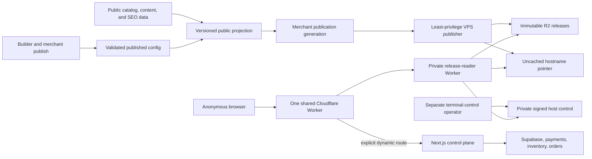

# Baci Multi-Tenant Edge Storefront Delivery Implementation Plan

> **Status:** Revision 3, upgraded on 2026-08-05 against `origin/main@33e8c0e80ef80891be4ac809362cf59781b758cf`. Execute each task as a separately reviewed PR unless a task explicitly says it is an operational evidence step. This plan does not authorize production mutations, Cloudflare provisioning, a `proxy.ts` change, or a new privileged database boundary by itself.

**Goal:** Remove eligible anonymous storefront browsing from Vercel for Baci's standard storefronts, then Ogabassey's custom theme, by publishing immutable merchant releases to private R2 and serving them through one shared public Cloudflare Worker plus one shared private reader Worker. Keep checkout, accounts, payments, orders, inventory validation, quiz, repairs, and other stateful commerce operations authoritative and dynamic.

**Business outcome:** Reduce the actual Vercel invoice, not merely improve a cache-hit metric. Before infrastructure work, prove that eligible storefront browsing is a material billed cost. After rollout, prove at least 99.9% origin avoidance for eligible requests and a measured reduction in Vercel billed usage that exceeds the incremental Cloudflare cost.

**Relationship to the older plan:** [`2026-07-27-ultra-low-cost-storefront-delivery.md`](./2026-07-27-ultra-low-cost-storefront-delivery.md) remains the historical Ogabassey evidence and security design. This plan replaces its **single-merchant-first rollout decision** with a generic release plane and a standard-theme-first pilot. Reuse its implemented evidence contracts and fail-closed operational lessons; do not carry forward its assumption that other merchants remain permanently on Vercel.

## Decision Summary

1. Build one multi-tenant release plane for Baci: one public serving Worker, one private reader Worker, one release bucket, one tiny separately authorized terminal-control bucket, and no server or code deployment per merchant.
2. Pilot the deterministic standard Baci/Puck theme first because its behavior is controlled and reusable. Use a synthetic fixture before enrolling one consenting, low-risk standard-theme merchant.
3. Add Ogabassey second through a dedicated renderer adapter because it is a custom theme. Ogabassey is the high-traffic savings canary, not the architecture template.
4. Store only public, published, bounded storefront data in immutable release objects. Drafts, customer data, credentials, private inventory controls, and provider responses never enter R2.
5. Serve known anonymous `GET`/`HEAD` browsing routes at the edge. Forward only explicitly classified dynamic routes to the unchanged application with method, body, query, cookies, `Origin`, and CSRF semantics preserved.
6. Keep the current Vercel/Supabase commerce control plane during the release-plane rollout. Decide whether remaining dynamic workloads move to the VPS or AWS only after the post-rollout bill shows what remains.
7. Do not set the whole Next.js application to `output: 'export'`. Next.js static export does not support request-dependent cookies, Proxy, rewrites, ISR, or Server Actions. Build a dedicated deterministic release renderer for the eligible route set instead.
8. Use Cloudflare for SaaS for merchant custom-hostname/TLS onboarding when the exact-host pilots are proven. Do not adopt Workers for Platforms unless Baci later permits merchants to execute arbitrary custom code; one shared public serving Worker is sufficient for the current product.
9. Keep both R2 buckets private. Use one additional unrouted, service-bound release-reader Worker so the public serving Worker cannot mutate or directly expose either bucket. This is still one shared multi-tenant serving plane, not per-merchant infrastructure.
10. Treat a storefront view as the complete browser request waterfall, not only the document request. An eligible passive browse is not origin-free if delayed analytics, component hydration, Supabase, image optimization, or same-origin API requests still reach Vercel.

## Current PR and Mainline Impact

| Change | Effect on this plan | Required response |
| --- | --- | --- |
| Open PR #3279, provider-neutral builder editing | Architecturally compatible. At the 2026-08-05 exact-head snapshot it is `BLOCKED` with one failed web-test shard; that mutable PR state is not a release-plane dependency. | Publisher reads the persisted, validated `page_configs.published_config`; it never accepts an AI/provider response as a release input. A draft AI edit causes no release until the merchant publishes it. Re-read its final merged component catalog before Task 1. |
| Open PR #3280, guarded Vercel attestation bootstrap | Architecturally compatible and not a release-plane dependency. At this revision it is stacked on #3279's branch rather than `main`; it remains disabled by default, production-only, and temporary. | Exclude the bootstrap route and all attestation secrets from static output. Complete its documented cleanup independently; do not treat it as permanent storefront runtime. Recheck live PR state rather than relying on this snapshot. |
| Merged PR #3266, deterministic curated defaults | Direct foundation for the standard-theme pilot. | Reuse `storefront-defaults` as the canonical fallback when a standard merchant has no custom published homepage. |
| Merged PR #3269, SEO/canonical parity | Adds mandatory release acceptance behavior. | Release output must match canonical, robots, sitemap, metadata, structured-data, and public-image eligibility contracts. |
| Merged PR #3260, unsafe storefront path rejection | Defines security and canonicalization behavior that the Worker must not contradict. | Create one shared, testable edge route contract and prove parity with current path behavior. Do not modify `apps/web/src/proxy.ts` without fresh explicit approval. |
| Merged PR #3282, production live quiz | Confirms that quiz is live, authenticated, and time-sensitive. | Keep `/quiz` and every `/api/quiz/**` request on the dynamic control plane. |
| Merged PR #3274, storefront order schema repair | Confirms order creation is database-authoritative. | Checkout and order creation always reach the current backend and recompute price, stock, promotion, shipping, tax, and final amount. |
| Merged PR #3250, Ogabassey origin contract | Provides reusable evidence and origin-budget primitives. | Generalize the manifest inventory to a cohort/merchant scope while preserving exact traffic partitions and fail-closed `NOT_PROVEN`. |
| GIGL/VPS cron cost work, including PR #3275 | Orthogonal and compatible. | Treat it as background-runtime savings; do not couple it to storefront release serving or expand its database authority. |

**Conclusion:** #3279 and #3280 do not block, invalidate, or materially overlap the edge-delivery architecture. Recent mainline work does affect the implementation contract: #3266 is the standard-theme source, while #3269, #3260, #3282, and #3274 define hard parity and dynamic-boundary requirements.

## Target Architecture



### Release layout

Use one production release bucket with tenant-separated immutable keys:

```text
hosts/{normalized-hostname}.json
merchants/{merchant-id}/releases/{release-id}/manifest.json
merchants/{merchant-id}/releases/{release-id}/pages/{route-hash}.html
merchants/{merchant-id}/releases/{release-id}/assets/{content-hash}.{ext}
renderers/{renderer-version}/assets/{content-hash}.{ext}
```

Use a separate private terminal-control bucket with one strongly consistent object per hostname:

```text
controls/hosts/{normalized-hostname}.json
```

- A release-bucket hostname pointer contains `schemaVersion`, normalized hostname, merchant ID, mode (`origin` or `edge`), monotonically increasing publication generation, immutable release ID, manifest key/hash, and activation time.
- The reader checks the terminal-control object before the release pointer on every request. A signed `disabled` host state or exact route tombstone overrides every release generation. Only a later, higher terminal-control generation signed by the terminal key can clear it; clearing the override does not activate content by itself and still requires a valid release pointer. Missing control means no prior override; malformed, stale, rollback, or unreadable control fails closed.
- Release IDs and object keys are immutable. A publisher uploads and reads back every object, then the manifest, and commits the pointer last with compare-and-swap generation fencing.
- Renderer CSS/JavaScript/font assets are immutable and shared across compatible merchant releases. Merchant-specific generated assets stay inside the merchant namespace.
- The pointer bypasses CDN caching. Immutable release objects receive long edge caching. This uses R2's strong read-after-write consistency without pretending the CDN cache is strongly consistent.
- Both R2 buckets are private: no public custom domain and no `r2.dev` endpoint. The normal publisher credential has no control-bucket authority; terminal-control credentials have no release-bucket authority. The public serving Worker has no R2 binding, Supabase, payment, AI, email, write, or service-role credential.
- A second global Worker, `storefront-release-reader`, has no public route, no custom domain, and `workers_dev = false`. It is reachable only through a service binding from `storefront-edge`, accepts only bounded `GET`/`HEAD` reads for validated control/pointer/manifest/object keys, and exposes no list, put, delete, multipart, or arbitrary-key surface. One focused module owns both raw R2 bindings and exports frozen `head`/`get` facades; AST and built-bundle negative-capability tests fail if mutation methods, dynamic raw-binding access, or binding re-exports appear.
- The reader's R2 bindings are platform-capable of mutation even though the deployed code is read-only. Therefore its code, deployment identity, and token are isolated from the public Worker and both writers; provider readback must prove that it has no public route. Task 0 records the current service-binding price contract (Cloudflare currently documents no added binding cost) and includes both buckets' R2 operations plus any reader error logs in the model rather than double-counting a second public invocation.
- Missing, malformed, or cross-tenant pointers do not silently flood Vercel. They return a bounded edge error and alert. Origin rollback is an explicit pointer mode change or exact route detachment.

### Publication input

The release builder consumes a versioned `StorefrontPublicProjection`, not live component queries:

- merchant public identity, hostname, published status, brand and theme tokens;
- validated `page_configs.published_config`, or the deterministic curated default from `apps/web/src/lib/storefront-defaults/`;
- published products, variants needed for display, categories, public media, blog/content pages, policies, reviews aggregate, and SEO decisions;
- public feature flags that affect rendered output; and
- no draft data, customer data, credentials, provider payloads, signed URLs, internal stock controls, or unpublished records.

The projection is provider-neutral. Cerebras, Groq, OpenRouter, or any later AI provider can propose builder changes, but only the persisted merchant-approved publication becomes release input.

### Route contract

The route classifier returns exactly one decision:

- `edge_release`: known public browsing `GET`/`HEAD` route with a release object;
- `edge_redirect`: canonicalization or allowlisted tracking-query removal that does not require origin;
- `origin_dynamic`: an explicitly listed stateful/machine route and allowed method; or
- `edge_terminal`: unknown path, unsupported method, malformed encoding, or disallowed query.

Initial edge-eligible routes include homepage, category/listing pages, PDPs, public content/policies, published blog pages, `robots.txt`, sitemaps, favicon, and the release 404. Search, cart, wishlist, reviews, and other ambiguous routes remain dynamic until their behavior is independently made snapshot-safe.

Always dynamic in the first release:

- every explicitly allowed non-`GET`/`HEAD` request; unknown mutation paths and unsupported methods terminate at the edge;
- `/api/**`, callbacks, webhooks, and machine endpoints;
- a closed platform-support allowlist for the current dynamic application's hashed `/_next/static/**` assets and any separately reviewed Next runtime/image endpoint needed by an `origin_dynamic` page. These requests remain measured origin traffic and receive bounded method/path/query/cache controls; unknown `/_next/**` paths terminate at the edge, and an edge release never references this allowlist;
- checkout, order success, order tracking, wallet, receipts, savings, negotiation, and payment flows;
- account, authentication, customer profile, and address flows;
- quiz, repair, IMEI, member-status, swap, and unlock flows; and
- draft preview, builder/dashboard, and any request whose response depends on cookies or private state.

Known static routes do not become origin-bound merely because they contain cookies or tracking parameters. Unknown routes for an enrolled edge hostname receive the immutable release 404; they do not fall through to Vercel. Released links use ordinary document navigation rather than depending on Next.js RSC/prefetch requests.

### Release component capability contract

The builder catalog is broader than the first edge-safe catalog. Every component type receives one versioned capability row containing:

- component and schema version;
- release mode: `static`, `client_island`, `origin_action`, or `unsupported`;
- public projection dependencies and maximum serialized size;
- deterministic renderer and immutable island asset ID;
- permitted automatic and user-triggered network destinations, methods, and path classes;
- CSP additions, third-party iframe/media policy, accessibility checks, and fallback behavior; and
- migration compatibility with the previous two capability versions.

Unknown component types, props, or capability versions fail closed. A merchant with an unsupported published component stays in explicit `origin` mode; the merchant's existing publication remains valid and no edge pointer is activated. The release failure is visible to operators and the merchant, but it never replaces a healthy origin storefront with an edge error. `CodeEmbed` is either rendered as escaped literal text or remains unsupported; stored text is never executed as HTML or JavaScript.

The release manifest binds `componentContractVersion`. Any builder-catalog PR, including the final merge of #3279, must update the capability matrix or prove that its change cannot reach published storefront output.

### Complete browser-origin contract

Origin avoidance is measured over a complete browser waterfall. The document request alone is not sufficient because current storefront code can schedule `/api/events`, `/baci-relay`, Vercel Analytics/Speed Insights, Supabase reads, image optimization, and component API requests after load or interaction.

Use the Codex in-app Browser's Chrome DevTools Protocol capability for real-browser operational evidence; do not add a standalone Playwright dependency for this gate. The operator procedure:

1. Open or claim a fresh in-app Browser tab against a unique synthetic hostname/release, navigate once to establish the target origin, enable the CDP `Network` domain, capture an event cursor, and reload into the measured run.
2. Record `Network.requestWillBeSent`, `Network.responseReceived`, loading completion/failure, redirect, initiator, method, resource type, status, and destination host/path class through document load, at least twenty seconds of idle time, scroll, pointer activation, keyboard activation, and an eligible same-site navigation.
3. Mark each scripted phase before performing it so the validator distinguishes `automatic_browse`, `explicit_dynamic_action`, and `approved_third_party` traffic.
4. Keep raw headers, bodies, cookies, query values, full URLs, customer identifiers, and browser-profile data in memory only. Immediately transform events into bounded host/method/path-class/resource-type/initiator aggregates, hash the sanitized artifact, and discard raw events.
5. Run both a first-navigation/cold-cache pass and a repeat-navigation/warm-cache pass. Run the repository validator over each sanitized ledger. `automatic_browse` must contain zero Vercel, Supabase, same-origin dynamic API, `/_next/image`, `/_next/static`, `/api/events`, `/baci-relay`, or other unapproved origin attempts. Approved third-party requests are still counted in the cost/privacy inventory. Explicit dynamic actions must match the route contract exactly.

CI validates the sanitizer, policy, fixture ledgers, and Worker-runtime integration tests. The in-app Browser supplies the operator-controlled, real-browser pilot census and visual interaction evidence that CI cannot reproduce. This replaces a standalone Playwright dependency for the operational census, but not reproducible CI fixtures or Worker-runtime integration tests. A Browser capture is necessary but not sufficient for the seven-day provider census.

Passive page-view analytics must not call Vercel. Before canary, choose and prove either a privacy-bounded edge ingestion path or direct approved analytics-provider delivery. Conversion, checkout, and other authoritative user actions may remain dynamic, but they must not expand the temporary service-role allowlist or expose merchant credentials.

### Release authenticity and key separation

Hashes detect corruption but do not authenticate caller-authored R2 bytes. Every activation therefore includes an Ed25519-signed authority envelope. A `release` envelope binds the normalized hostname, merchant ID, publication generation, release ID, projection hash, manifest hash, renderer version, component-contract version, issued time, signing-key ID, and schema version. A separately typed `terminal_control` envelope can authorize only a durable disabled/enabled host override or exact route tombstone and binds its reason class, target, monotonic control generation, issued time, operator receipt hash, signing-key ID, and schema version.

- The Worker pins separate allowlists for current/retiring release-signing and terminal-control public keys, verifies the exact envelope type before acting, and never accepts a terminal key for an `edge` release or a release key for an emergency tombstone.
- Each signing private key is separate from its corresponding R2 write credential and stored as a mode-`0600`, dedicated secret outside ordinary application/Vercel environments. An R2-token leak alone cannot forge an accepted release or terminal action.
- Key rotation overlaps old/new verification keys for a bounded window. Revocation, rotation, and recovery are tested; a revoked key cannot activate a new generation.
- Publisher-host compromise remains a documented residual risk because that host can use the release-bucket credential and release-signing key together to forge content. It still cannot write or clear the separate control bucket. Incident response uses the isolated terminal operator to disable the exact hostname, then rotates the publisher's R2 and signing authorities independently.

### Commerce freshness and terminal control

The manifest labels every route dependency with a freshness class. Proposed defaults become authoritative only after owner approval in Task 0:

- `terminal_control`: merchant deletion, domain disablement, legal takedown, or product recall. The operation is not acknowledged until a separate break-glass control path has committed and read back a signed disabled host override or exact route tombstone from the control bucket. Target: 60 seconds; breach freezes edge enrollment.
- `offer_critical`: product unpublish, price, promotion, or purchasability changes. Priority generation target: two minutes p95, ten-minute hard breach. A breach triggers bounded exact-host/route origin rollback or an edge terminal response; the Worker never silently serves a known-expired offer.
- `inventory_advisory`: snapshot stock may be displayed with a freshness label, but checkout always revalidates authoritative stock and price. Target: five minutes p95.
- `content_standard`: brand, blog, policy, and ordinary copy changes. Target: five minutes p95.

The primary publisher credentials cannot be the break-glass credentials. Terminal control has a separate least-privilege R2 identity and terminal-only signing key, dual confirmation, exact-target readback, audit receipt, and revocation procedure. Publisher outage behavior is explicit per freshness class; "serve the last release forever" is not a valid universal fallback.

## Success and Stop Gates

### Business gate

Before Task 2 starts, collect a sealed seven-day baseline from Vercel and Cloudflare and calculate:

- Vercel invocations, active CPU, provisioned memory, origin transfer, cache writes/reads, and billed amount attributable to storefront hosts and paths;
- eligible anonymous browsing requests by hostname, method, path class, status, and origin decision;
- current cost per 1,000 complete eligible browser views, including document and automatic subrequests; and
- projected public Worker, current service-binding price contract, R2 Class A/B, storage, signatures, provider-generated invocation logs, one custom public-decision log per request, bounded reader error/security logs, custom-hostname, and egress costs at current traffic plus 2x headroom. Do not assume that suppressing `console` output removes provider-generated log events; use provider readback and measured event counts.

The 20% attribution, 80% normalized-runtime reduction, and 2x Cloudflare-cost multiple are proposed defaults, not implied owner approval. Task 0 records explicit owner acceptance or replacements plus an absolute monthly net-savings floor in USD and NGN. Stop this work and prioritize remaining dynamic/VPS offloads if the accepted gate fails. Do not infer savings from request count alone.

Freeze and hash the hostname inventory and eligibility policy before the baseline. Any later policy expansion, contraction, or host omission invalidates the baseline/post-rollout comparison and requires a new complete window.

### Technical gate

Expansion beyond one standard merchant requires:

- at least 99.9% origin avoidance for eligible requests over a complete seven-day census;
- zero automatic Vercel/Supabase/dynamic-origin requests in each sanitized in-app Browser CDP acceptance ledger;
- zero unknown or rejected-method origin attempts;
- zero cross-tenant object, pointer, hostname, cache-key, or redirect leakage;
- a private R2 topology with no public endpoint or `r2.dev` access on either bucket, no public reader route, and provider readback matching the reviewed topology;
- valid signed release authority for every served generation, plus successful rotation/revocation recovery drills;
- exact dynamic preservation of method, body, query, cookies, host, `Origin`, and CSRF behavior;
- SEO, accessibility, responsive, checkout-handoff, and visual parity for the pilot merchant;
- freshness and terminal-control SLOs for every approved data class, with no known-expired offer served silently;
- tested pointer rollback in five minutes or less without a code deployment;
- the owner-approved normalized Vercel invocation/compute reduction for the enrolled cohort's eligible browsing; and
- the owner-approved relative and absolute monthly net-savings gates in USD and NGN.

If the 99.9% gate passes but the total Baci Vercel invoice does not materially fall, do not enroll more merchants until the remaining bill categories are identified.

### Fast execution order

- Run Task 0 and Task 1 in parallel; neither mutates production. Task 1 includes the component, browser-waterfall, release-authority, and freshness contracts.
- Start the pure Task 2 renderer only after Task 0 returns `PROCEED` and Task 1's schemas are stable. Its tests consume bounded projection fixtures, not the Task 3 RPC.
- Build Task 3 after Task 1. Start Task 4 only after both the Task 2 renderer and Task 3 claim/ledger contract are green.
- Task 5 may build against signed fixtures while Tasks 2-4 build the production projection/publisher path, but Task 6 requires all of them.
- Tasks 7-10 are sequential operational gates. Do not hide a failed standard pilot by jumping directly to Ogabassey.
- Rebase every implementation PR onto current `main`. If #3279 merges before Task 2, run its builder-catalog and theme compatibility tests against the release projection. If it merges later, #3279 must pass the release-projection tests before it can publish a new component shape. #3280 has no renderer dependency.

### Per-PR validation contract

Run each task's focused checks first. Every code or migration PR then runs `pnpm turbo lint && pnpm turbo typecheck && pnpm turbo test` from the repository root and `coderabbit review --agent -t uncommitted` before commit. Workflow changes also require the repository Actionlint check; shell changes require `bash -n` and ShellCheck. A task is not complete because its focused test alone passed.

## Implementation Tasks

### Task 0: Seal the Current Cost and Traffic Contract

**Files:**

- Modify: `packages/shared/src/storefront/delivery-evidence*.ts`
- Modify: `apps/web/tools/cost/storefront-origin-budget*.ts`
- Create: `apps/web/tools/cost/storefront-cohort-cost-baseline.ts`
- Create: `apps/web/tools/cost/storefront-cohort-cost-baseline.test.ts`
- Create: `apps/web/tools/cost/validate-storefront-browser-waterfall.ts`
- Create: `apps/web/tools/cost/validate-storefront-browser-waterfall.test.ts`
- Modify: `docs/ops/storefront-origin-budget.md`

- [ ] Parameterize the existing Ogabassey evidence manifest with an explicit cohort ID and complete hostname inventory while preserving exact per-host/method/path-class/rule reconciliation.
- [ ] Add Vercel billed-unit inputs and Cloudflare incremental-cost inputs; keep credentials and raw URLs out of artifacts.
- [ ] Collect provider data in isolated credentialed processes using dedicated read-only Vercel and Cloudflare tokens with exact account/zone scopes. Never reuse the production cache-purge token. Write only bounded signed aggregates, then run qualification/readback in a separate process that rejects all provider credentials from its environment; rotate or revoke collection tokens after the sealed window.
- [ ] Reuse the #3250 account-wide Workers Logs capacity contract. Require provider readback of `head_sampling_rate = 1`, reconcile projected storefront plus all other-Worker volume with approved headroom, and prove the account will remain below forced-sampling limits throughout the evidence window.
- [ ] Reconcile independent Cloudflare request/log aggregates, R2 operations, enrolled-host inventory, and Vercel/origin attempts by host, method, path class, decision/rule ID, and day. Workers Logs are never the sole authority for a 99.9% result.
- [ ] Make missing, sampled, capacity-uncertain, stale, unauthenticated, or unreconciled inputs produce `NOT_PROVEN`, never `PASS`.
- [ ] Add a credentialless validator for sanitized in-app Browser CDP waterfall aggregates. The validator rejects raw URLs, query values, headers, bodies, cookies, identifiers, unknown hosts/path classes, missing scripted phases, and automatic origin attempts.
- [ ] Record owner-approved relative thresholds and an absolute monthly net-savings floor in USD and NGN. Until signed, the 20%/80%/2x defaults are proposals and Task 2 remains blocked.
- [ ] Capture an authenticated seven-day production baseline as a non-executable evidence artifact after the tooling PR merges.
- [ ] Record a `PROCEED` or `STOP` business decision using the approved bill-attribution and absolute-savings gates.

**Validation:**

```bash
pnpm --filter @baci/shared test
pnpm --filter @baci/web test -- storefront-origin-budget storefront-cohort-cost-baseline storefront-browser-waterfall
pnpm --filter @baci/shared typecheck
pnpm --filter @baci/web typecheck:tools-workers
```

### Task 1: Define Shared Release, Projection, and Route Contracts

**Files:**

- Create: `packages/shared/src/storefront-release/release-manifest-schema.ts`
- Create: `packages/shared/src/storefront-release/release-manifest-schema.test.ts`
- Create: `packages/shared/src/storefront-release/hostname-pointer-schema.ts`
- Create: `packages/shared/src/storefront-release/hostname-pointer-schema.test.ts`
- Create: `packages/shared/src/storefront-release/public-projection-schema.ts`
- Create: `packages/shared/src/storefront-release/public-projection-schema.test.ts`
- Create: `packages/shared/src/storefront-release/release-authority-envelope-schema.ts`
- Create: `packages/shared/src/storefront-release/release-authority-envelope-schema.test.ts`
- Create: `packages/shared/src/storefront-release/terminal-control-authority-envelope-schema.ts`
- Create: `packages/shared/src/storefront-release/terminal-control-authority-envelope-schema.test.ts`
- Create: `packages/shared/src/storefront-release/release-component-capability-schema.ts`
- Create: `packages/shared/src/storefront-release/release-component-capability-schema.test.ts`
- Create: `packages/shared/src/storefront-release/browser-waterfall-evidence-schema.ts`
- Create: `packages/shared/src/storefront-release/browser-waterfall-evidence-schema.test.ts`
- Create: `packages/shared/src/storefront-release/storefront-release-freshness-policy.ts`
- Create: `packages/shared/src/storefront-release/storefront-release-freshness-policy.test.ts`
- Create: `packages/shared/src/storefront-release/classify-storefront-edge-request.ts`
- Create: `packages/shared/src/storefront-release/classify-storefront-edge-request.test.ts`
- Create: `apps/web/src/lib/storefront-release/standard-component-capabilities.ts`
- Create: `apps/web/src/lib/storefront-release/standard-component-capabilities.test.ts`
- Create: `apps/web/src/lib/storefront-release/storefront-edge-route-parity.test.ts`

- [ ] Define strict, versioned Zod schemas with bounded route counts, object sizes, aggregate release bytes, path lengths, content types, and hashes.
- [ ] Bind the signed release-authority envelope, component-contract version, projection hash, renderer version, and per-route freshness class into the manifest/pointer schemas. Define a disjoint terminal-control envelope whose keys can authorize only durable disabled/enabled overrides or exact route tombstones in the control bucket; it cannot activate a release.
- [ ] Build a versioned row for every currently publishable builder component. Mark it `static`, `client_island`, `origin_action`, or `unsupported`; enumerate data dependencies, scripts, allowed destinations/methods, CSP, size, and fallback. A catalog diff without a capability decision fails CI.
- [ ] Define sanitized Browser-CDP evidence rows and scripted phases without raw URLs, query values, headers, cookies, bodies, or customer/browser identifiers.
- [ ] Normalize hostnames, routes, and queries once; reject encoded separators, dot segments, control characters, unsupported Unicode ambiguity, cross-tenant keys, and JavaScript-number generation overflow.
- [ ] Encode the static/dynamic/terminal matrix above as data and pure functions, not Worker-only string checks.
- [ ] Add parity tests against current storefront route and path-safety behavior, including the #3260 over-encoding cases.
- [ ] Define failure behavior: unsupported component/configuration keeps the merchant on origin; terminal-control failures block acknowledgement; an offer-freshness breach can only select the reviewed exact-route/host rollback or terminal policy.
- [ ] Keep `apps/web/src/proxy.ts` unchanged. If parity cannot be achieved without changing it, stop for explicit owner approval and isolate that change in its own PR.

**Validation:**

```bash
pnpm --filter @baci/shared test -- storefront-release
pnpm --filter @baci/web test -- standard-component-capabilities storefront-edge-route-parity
pnpm exec biome check packages/shared/src/storefront-release apps/web/src/lib/storefront-release
pnpm --filter @baci/shared typecheck
pnpm --filter @baci/web lint
pnpm --filter @baci/web typecheck
```

### Task 2: Build the Pure Deterministic Standard-Theme Release Renderer

**Files:**

- Create: `apps/web/src/lib/storefront-release/validate-storefront-public-projection.ts`
- Create: `apps/web/src/lib/storefront-release/validate-storefront-public-projection.test.ts`
- Create: `apps/web/src/lib/storefront-release/build-standard-storefront-release.ts`
- Create: `apps/web/src/lib/storefront-release/build-standard-storefront-release.test.ts`
- Create: `apps/web/src/components/storefront-release/render-standard-puck-release.tsx`
- Create: `apps/web/src/components/storefront-release/render-standard-puck-release.test.tsx`
- Create: focused route, SEO, asset, and dependency-index modules with colocated tests under `apps/web/src/lib/storefront-release/`
- Modify only as adapters: `apps/web/src/lib/storefront-defaults/*`
- Reuse acceptance behavior from: `apps/web/src/app/(storefront)/[slug]/**`

- [ ] Accept one already-materialized, transactionally coherent `StorefrontPublicProjection` value. Validate it at the boundary, then render as a pure projection-plus-renderer-version function with no database client, RPC, network, environment-secret, or filesystem mutation dependency.
- [ ] Use bounded projection fixtures in Task 2 tests. In production, Task 4 passes the generation-fenced projection returned by Task 3's single claim RPC; renderer code never knows how the value was loaded and never re-queries component tables.
- [ ] Validate `published_config` against the closed builder component catalog and exact capability-contract version. Reject unknown components, arbitrary executable HTML/JS, private or mutable URLs, unbounded props, and any destination absent from the capability row.
- [ ] Return `ineligible_configuration` without activating a pointer when an existing merchant uses an unsupported component. Do not fail or roll back the merchant's ordinary origin publication.
- [ ] Use #3266 curated defaults only when no merchant-published standard configuration exists.
- [ ] Render deterministic HTML, CSS, minimal executable assets, metadata, JSON-LD, canonical links, public catalog pages, content, sitemaps, robots, and a real 404 without request-time Supabase or Vercel dependencies.
- [ ] Render through a bounded library/CLI call; never run a full `next build`, create a Vercel deployment, or compile a separate application per merchant or publication generation.
- [ ] Emit a deterministic route-dependency index and per-route input/content hashes without accepting a prior manifest. Task 4 may use those hashes to reuse verified immutable objects when renderer compatibility is known; reuse changes work performed, never output bytes.
- [ ] Ensure Puck components that currently fetch at runtime receive release projection data instead. Do not serialize live Supabase calls into the browser.
- [ ] Replace root/storefront automatic `/api/events`, `/baci-relay`, Vercel Analytics/Speed Insights, Puck-config, product-grid, and image-optimization calls with no request or the approved edge/direct-provider equivalent. Preserve explicit user-action semantics separately.
- [ ] Emit only capability-declared client islands. Every island has a content-addressed bundle, bounded hydration props, CSP entry, and test proving its automatic network ledger is empty or exactly allowlisted.
- [ ] Match #3269 canonical/indexing decisions and preserve accessible landmarks, product links, image dimensions, responsive behavior, and checkout/cart handoff URLs.
- [ ] Emit no `/_next/image`, `/_next/static`, Vercel Analytics, or request-time image-optimization dependency. External media URLs must be immutable/versioned and approved by capability policy; otherwise publish content-addressed release derivatives with explicit dimensions.
- [ ] Prove byte-for-byte determinism for the same projection and renderer version.
- [ ] Emit the unsigned authority-envelope payload and projection/manifest hashes for Task 4 signing; renderer code never receives the private signing key.

**Validation:**

```bash
pnpm --filter @baci/web test -- storefront-release storefront-defaults
pnpm --filter @baci/web lint
pnpm --filter @baci/web typecheck
```

### Task 3: Add a Transactional Publication Generation and Release Ledger

**Approval gate:** This task adds migrations and a new machine capability. Obtain owner/security approval for the exact tables, RPCs, grants, caller identity, header-token verifier, and VPS credential before implementation. Existing migrations remain append-only.

**Files:**

- Create: `supabase/migrations/<timestamp>_create_storefront_release_ledger.sql`
- Create: `supabase/migrations/<timestamp>_add_storefront_release_worker_authority.sql`
- Create: `supabase/migrations/<timestamp>_add_storefront_release_projection_claim.sql`
- Create: `supabase/migrations/<timestamp>_enqueue_storefront_release_generations.sql`
- Create: `supabase/tests/storefront_release_ledger.test.sql`
- Create: `supabase/tests/storefront_release_projection.test.sql`
- Create: `supabase/tests/storefront_release_authority.test.sql`
- Create: `supabase/tests/run-storefront-release-ledger-test.sh`
- Create: `apps/web/src/schemas/storefront-release-job.ts`
- Create: `apps/web/src/schemas/storefront-release-job.test.ts`
- Modify through a new append-only migration: cache-invalidation enqueue functions/triggers
- Modify: database replay manifests required by repository checks

- [ ] Create one coalescing pending generation per merchant and immutable release rows with `queued`, `claimed`, `building`, `objects_verified`, `pointer_committed`, `active`, `failed`, `retired`, and `deleted` transitions.
- [ ] Keep each append-only migration and SQL test focused and under 300 lines. Order schema, worker authority, projection claim, and enqueue integration explicitly; do not hide this boundary in one oversized migration.
- [ ] Fence claims by generation, lease, and random claim token. A stale worker cannot activate or complete a later generation.
- [ ] Extend the central public-output invalidation/enqueue boundary so every committed change that affects a release also bumps the merchant publication generation in the same transaction.
- [ ] Audit all public-output dependencies: published builder config, merchant identity/domain/theme, products/variants/offers, categories, media, blogs/pages/policies, public features, SEO settings, and deletion.
- [ ] Implement one statement-scoped `claim_storefront_release_projection` RPC that claims a generation under lease and returns the complete bounded, versioned projection plus projection hash from one PostgreSQL MVCC snapshot. The publisher performs no follow-up table reads for that generation.
- [ ] Authenticate claim/complete/fail RPCs with a dedicated random 256-bit `STOREFRONT_RELEASE_WORKER_TOKEN` supplied only in a redacted TLS header. A private verifier table stores only a one-way verifier, not the recoverable token. Validate the token before claims, tenant selection, or data reads; return one fixed-shape rejection; bind completion to the returned random claim token and generation.
- [ ] Invoke through the ordinary public Supabase/PostgREST endpoint with the public anon key. Do not place a Supabase service-role key, JWT-signing secret, custom trusted claims, or direct/broad database login on the VPS.
- [ ] Pin `search_path = ''`, schema-qualify every object, revoke wrapper execution from `PUBLIC`/`authenticated`, grant only the minimum callable wrappers to `anon`, and keep the secret-derived authority inside those wrappers. Prove the worker token adds no authority to unrelated `PUBLIC` functions, cannot spoof `auth.uid()`/role claims, and cannot read private tables.
- [ ] Before cutover, run a disposable real PostgREST integration probe proving the exact custom header reaches only the intended wrapper, is absent from provider/application logs and error bodies, and can be rate-limited on the three exact RPC paths. Seal only redacted results and revoke the probe token.
- [ ] Version and bound the projection JSON. SQL tests prove one-snapshot coherence under concurrent product/config/domain updates, complete explicit-column coverage, tenant isolation, replay rejection, lease expiry, token rotation/revocation, and negative capability closure.
- [ ] Make merchant deletion/takedown win over publication and prevent an older release from being reactivated.
- [ ] Record freshness class and priority on each generation. A terminal-control operation cannot be acknowledged solely because a database row changed; it requires the separate Cloudflare control receipt/readback defined in Task 4.

**Validation:**

```bash
bash supabase/tests/run-storefront-release-ledger-test.sh
pnpm --filter @baci/web db:replay:chronological
pnpm --filter @baci/web test -- storefront-release-job
pnpm --filter @baci/web lint
pnpm --filter @baci/web typecheck
pnpm --filter @baci/web typecheck:tools-workers
```

### Task 4: Build the Least-Privilege VPS Publisher and R2 Reconciler

**PR split:** Implement 4A (ordinary publisher/reconciler) and 4B (terminal-control tooling) as separate reviews. Their credentials, signing keys, environment schemas, and runnable entry points must never coexist in one process or deployment artifact.

**Files:**

- Create: `apps/web/src/scripts/process-storefront-releases.ts`
- Create: `apps/web/src/scripts/process-storefront-releases.test.ts`
- Create: `apps/web/src/lib/storefront-release/publish-storefront-release.ts`
- Create: `apps/web/src/lib/storefront-release/publish-storefront-release.test.ts`
- Create: `apps/web/src/lib/storefront-release/reconcile-storefront-release.ts`
- Create: `apps/web/src/lib/storefront-release/reconcile-storefront-release.test.ts`
- Create: `apps/web/src/lib/storefront-release/write-storefront-terminal-control.ts`
- Create: `apps/web/src/lib/storefront-release/write-storefront-terminal-control.test.ts`
- Create: `apps/web/src/scripts/execute-storefront-terminal-control.ts`
- Create: `apps/web/src/scripts/execute-storefront-terminal-control.test.ts`
- Create: `apps/web/src/schemas/storefront-release-publisher-env.ts`
- Create: `apps/web/src/schemas/storefront-release-publisher-env.test.ts`
- Create: `apps/web/src/config/non-agentic-worker-profiles.ts`
- Create: `apps/web/src/config/non-agentic-worker-profiles.test.ts`
- Modify: `apps/web/tsconfig.tools-workers.json`
- Modify only as an adapter: `apps/web/src/env.ts`
- Create: `vps-workers/bin/process-storefront-releases.sh`
- Create: `vps-workers/bin/verify-storefront-release-worker-installed.sh`
- Create: `vps-workers/lib/install-storefront-release-worker.sh`
- Create: `vps-workers/lib/install-storefront-release-worker.test.sh`
- Modify only as an installer adapter: `vps-workers/deploy.sh`
- Modify: `vps-workers/jobs/preflight-direct-web-workers.mjs`
- Modify: `docs/ops/vps-workers.md`

- [ ] Use a release-bucket-scoped Cloudflare credential available only to the publisher process; it has no control-bucket authority. Start the process with an allowlisted environment and no AI/payment/email/service-role secrets.
- [ ] Keep four authorities separate: the normal publisher's release-bucket R2 credential and release-signing key, plus the break-glass command's terminal-control R2 parent credential and terminal-only signing key. The normal process receives only its pair. After dual confirmation and exact-target display, use trusted operator-side local signing to mint an R2 temporary credential restricted to the one control object, shortest practical TTL, and only `GetObject`, `HeadObject`, and `PutObject` (Cloudflare's API-minted temporary credentials do not yet support explicit action lists). Never permit list, delete, multipart, release-bucket, or bucket-administration actions, and never place the parent credential on the publisher or ordinary command process.
- [ ] Load the terminal parent credential and signing key only from separate mode-`0600` secret descriptors or an approved OS secret store in the isolated operator environment, never argv, ordinary environment files, CI artifacts, shell history, logs, or command output. Pass only the path-scoped temporary session to the writer child and close the session on every exit path.
- [ ] Claim the bounded one-snapshot projection, coalesce a merchant generation, build its release, upload content-addressed objects, verify metadata and hashes, upload/read back the manifest, sign the exact authority envelope, verify the signature locally, then compare-and-swap the hostname pointer.
- [ ] Prove R2 conditional pointer writes with a disposable non-production provider probe before implementation depends on them. Pin the API/SDK operation and precondition headers; a failed precondition returns reconciliation, never an unconditional overwrite.
- [ ] Reuse unchanged content-addressed pages and shared renderer assets across releases. A burst of catalog events coalesces to the latest generation rather than producing one full release per event.
- [ ] Make every step idempotent. A timeout or crash enters read-only reconciliation before any write is retried.
- [ ] Preserve the active release plus at least two verified rollback releases. Garbage collection never deletes a pointer target, live build, deletion proof, or protected rollback.
- [ ] Process `offer_critical` ahead of ordinary content and measure queue-to-pointer readback against the approved freshness SLO. `terminal_control` bypasses the ordinary publisher queue and uses only the isolated control command/bucket; the normal publisher never receives terminal credentials. Freeze enrollment on either SLO breach.
- [ ] Implement an isolated terminal-control command that can sign and write only the typed `terminal_control` envelope plus a disabled/enabled host override or exact route tombstone in the control bucket. It reads the result back through the serving path, verifies target/control-generation/receipt hash, emits a redacted audit receipt, destroys the temporary session, and proves expiry. If early invalidation is required, revoke the isolated parent R2 token. The offline terminal signing key is unmounted after use and rotated only through its separate reviewed procedure. A terminal key can clear an override but can never activate an `edge` release.
- [ ] Install one `flock`-guarded worker schedule with bounded batch, deadline, retry/backoff, dead-letter alerting, release SHA verification, and readiness smoke.
- [ ] Keep `vps-workers/deploy.sh` below 300 lines by putting the new file installation, canonical cron rendering, and verification logic in the focused installer module; the root deploy script only invokes it.
- [ ] Add both new scripts and their tests to `tsconfig.tools-workers.json`; the normal web project excludes `src/scripts/**`. Extract the touched non-agentic worker-profile list from the 1,600-line `env.ts` into the focused config module, then keep `env.ts` as a thin consumer. Define and test a separate strict `storefront-release-publisher` env schema that requires only the reviewed projection token, release-bucket, signing, and provider settings and rejects unrelated AI/payment/email/service-role secrets. The terminal command is not a publisher profile and rejects publisher, service-role, AI, payment, and email credentials.
- [ ] Make the installed-worker verifier compare the delegated application checkout and wrapper to the workflow/deploy SHA, rerun the profile preflight, and execute credentialless plus authenticated readiness probes before any rollout task can depend on the schedule.
- [ ] Do not remove any current Vercel path or route in this task.

**Validation:**

```bash
pnpm --filter @baci/web test -- process-storefront-releases publish-storefront-release reconcile-storefront-release storefront-terminal-control storefront-release-publisher-env non-agentic-worker-profiles
pnpm --filter @baci/web lint
pnpm --filter @baci/web typecheck:tools-workers
shellcheck vps-workers/bin/process-storefront-releases.sh
bash -n vps-workers/bin/process-storefront-releases.sh
shellcheck vps-workers/bin/verify-storefront-release-worker-installed.sh
bash -n vps-workers/bin/verify-storefront-release-worker-installed.sh
shellcheck vps-workers/lib/install-storefront-release-worker.sh vps-workers/lib/install-storefront-release-worker.test.sh
bash -n vps-workers/lib/install-storefront-release-worker.sh vps-workers/lib/install-storefront-release-worker.test.sh
bash vps-workers/lib/install-storefront-release-worker.test.sh
```

### Task 5: Implement the Shared Serving Worker, Private Reader, and Deployment Topology

**Files:**

- Create: `apps/storefront-edge/package.json`
- Create: `apps/storefront-edge/wrangler.jsonc`
- Create: `apps/storefront-edge/src/index.ts`
- Create: focused modules and colocated tests under `apps/storefront-edge/src/`
- Create: `apps/storefront-release-reader/package.json`
- Create: `apps/storefront-release-reader/wrangler.jsonc`
- Create: `apps/storefront-release-reader/src/index.ts`
- Create: focused modules and colocated tests under `apps/storefront-release-reader/src/`
- Create: `apps/web/tools/cost/storefront-edge-topology.ts`
- Create: `apps/web/tools/cost/storefront-edge-topology.test.ts`
- Create: `.github/workflows/deploy-storefront-edge.yml`
- Create: `.github/workflows/storefront-edge-quality.yml`
- Create: `.github/scripts/storefront-edge-workflow-contract.test.mjs`
- Create: `.github/scripts/storefront-edge-ci-filter-contract.test.mjs`
- Modify only as a reusable-workflow adapter: `.github/workflows/ci.yml`
- Modify: `.github/filters/ci.yml`
- Modify: root workspace/Turbo configuration only as required
- Create: `docs/ops/storefront-edge.md`

- [ ] Parse and validate the request hostname before pointer lookup. Only an exact enrolled hostname can select a pointer.
- [ ] Import the shared route classifier; define no second method/path vocabulary in Worker code.
- [ ] Bind the public Worker to the private reader through a service binding. Give only the reader the release- and terminal-control-bucket R2 bindings. Both Workers disable `workers.dev`; the reader has zero routes/custom domains and fails provider readback if any public ingress exists.
- [ ] Make the reader accept only `GET`/`HEAD`, a closed typed service-binding request, and normalized pointer/manifest/object keys. Reject direct/unbound ingress, arbitrary prefixes, mutation, range abuse, cross-tenant keys, and oversized responses. One module owns the raw binding and exposes a frozen read-only facade. Test the AST and built bundle for mutation symbols, computed raw-binding access, and binding re-export paths; provider topology readback proves that only the reviewed public Worker holds the service binding.
- [ ] Fetch and verify the uncached terminal-control object first. A valid disabled override/tombstone terminates before any release lookup; only a higher valid terminal-control generation clears it. Then fetch the uncached release pointer, validate its Ed25519 authority envelope, tenant/release/generation binding and manifest hash, and serve only manifest-listed immutable objects. Unknown/revoked signing keys fail closed.
- [ ] Use cache keys containing hostname, merchant ID, release ID, route, encoding, and content variant. Never vary release HTML by cookies or unbounded query strings.
- [ ] Preserve `HEAD`, conditional requests, range behavior for approved assets, content type, CSP, HSTS, robots, canonical headers, and a bounded release 404.
- [ ] Before relying on origin forwarding, run a disposable non-production exact-route probe. For the Baci-subdomain pilot, prove that a Cloudflare Route in front of the existing DNS application origin can call `fetch()` on the incoming request without recursion and preserve host, method, body, headers, cookies, query, and `Origin`. Delete the probe route and seal its readback receipt.
- [ ] Forward only `origin_dynamic` requests through that proven exact topology. The later Cloudflare-for-SaaS wildcard topology is a separate Task 8 gate and may not assume that same-host forwarding still reaches the prior origin.
- [ ] Return edge `404`, `405`, or `400` for terminal decisions without origin access. Control/pointer/manifest failure returns a bounded `503` and alert, not automatic origin fallback.
- [ ] Emit exactly one custom privacy-bounded decision record per public request, compatible with the existing delivery-evidence schema; the reader emits no custom success record and only bounded error/security events. Inventory and cost provider-generated invocation events separately so the model does not mistake one custom log for one total log event. Never log raw URLs, queries, cookies, tokens, customer identifiers, or bodies. Read back 100% head sampling and account-capacity qualification before any evidence window.
- [ ] Keep both R2 buckets entirely private. Prove no public custom domain or `r2.dev` endpoint exists, terminal-control and pointer paths bypass cache, immutable objects use the reviewed cache policy, publisher/control credentials are bucket-disjoint, and the public Worker cannot address objects outside a validated control/pointer/manifest request.
- [ ] Check in a declarative topology manifest covering Worker names/digests, compatibility dates, service binding, both R2 bindings, exact routes/exclusions, cache rules, log sampling, custom domains, `workers.dev`, gradual-deployment/version-affinity rules, and token permission/resource scopes. A credentialless validator compares provider readback to the manifest and returns `NOT_PROVEN` on drift.
- [ ] Pull requests compile, test, statically inspect, and preview bundles without provider credentials or deployment. A protected main workflow uploads immutable Worker versions only after green exact-head CI. Production traffic-weight/route promotion is a separate environment-approved job bound to the reviewed SHA, artifact digests, signed release-schema compatibility, provider readback, and rollback version.
- [ ] Promote the private reader before a public Worker version that depends on it. Smoke a candidate reader through a service-binding version override, keep reader/public request schemas backward-compatible across adjacent versions, and roll back either deployment independently.
- [ ] Separate code-version upload authority from route/traffic promotion authority where Cloudflare token scoping permits it. Tokens are environment-scoped, never exposed to fork/PR code, have documented rotation/revocation, and are rejected by credentialless readback/evidence commands.
- [ ] Add a dedicated `storefront_edge` CI change flag and lightweight Worker jobs. A Worker-only PR must not run the unrelated full web suite; shared release contracts and web topology adapters deliberately trigger both web and edge gates. Prove Worker, reader, Wrangler, topology, shared-contract, lockfile/workspace, workflow, and filter-file mappings in the CI filter contract test.
- [ ] Keep the oversized root CI workflow as a thin caller: put edge lint/typecheck/test/bundle logic in the focused reusable `storefront-edge-quality.yml` workflow rather than adding another large inline job graph to `.github/workflows/ci.yml`.
- [ ] Require the existing repository Actionlint workflow to pass on the exact head for every workflow change; its path filter already covers `.github/workflows/**` and must remain pinned in the workflow contract test.

**Validation:**

```bash
pnpm --filter @baci/shared test
pnpm --filter @baci/storefront-edge test
pnpm --filter @baci/storefront-release-reader test
pnpm --filter @baci/storefront-edge lint
pnpm --filter @baci/storefront-release-reader lint
pnpm --filter @baci/storefront-edge typecheck
pnpm --filter @baci/storefront-release-reader typecheck
pnpm --filter @baci/web test -- storefront-edge-topology
node --test .github/scripts/storefront-edge-workflow-contract.test.mjs
node --test .github/scripts/storefront-edge-ci-filter-contract.test.mjs
actionlint .github/workflows/deploy-storefront-edge.yml .github/workflows/storefront-edge-quality.yml .github/workflows/ci.yml
pnpm turbo lint && pnpm turbo typecheck && pnpm turbo test
```

### Task 6: Prove a Synthetic Standard Store Without Production Routing

- [ ] Generate bounded fixture merchants using the curated standard theme, products, categories, policies, blog, SEO, and every component capability mode. Include an unsupported-component fixture that stays on origin without publication regression.
- [ ] Publish it to non-production release/control buckets and a synthetic hostname, then test with the real Worker runtime, not a Node-only mock.
- [ ] Prove neither bucket has a public endpoint, the reader has no public ingress, direct known-object URLs are unreachable, signed release/control envelope verification succeeds, and tampered control/pointer/manifest/object/key/signature cases fail closed.
- [ ] Compare origin and release outputs for route inventory, status, canonical/robots/sitemap/JSON-LD, security headers, accessibility, responsive screenshots, links, image behavior, and 404s.
- [ ] Exercise malformed hosts, cross-tenant object keys, over-encoded paths, traversal, tracking queries, RSC/prefetch headers, unsupported methods, stale pointers, partial uploads, and pointer rollback.
- [ ] Prove dynamic handoff for checkout/account/quiz/order/repair paths with cookies and CSRF; use mocks or isolated test systems, never real payments or customer data.
- [ ] Use a fresh Codex in-app Browser tab with CDP Network events to capture first-navigation/cold and repeat-navigation/warm document load, twenty-second idle, scroll, pointer, keyboard, and eligible navigation phases against a unique synthetic hostname/release. Sanitize in memory, discard raw events, and seal only aggregate artifacts. Require zero automatic Vercel/Supabase/dynamic-origin requests and exact classification of explicit actions.
- [ ] Exercise the current delayed-risk inventory explicitly: `/api/events`, `/baci-relay`, Vercel Analytics/Speed Insights, Puck config, product-grid data, `/_next/image`, `/_next/static`, prefetch/RSC, WebMCP, newsletter/form, and approved third parties.
- [ ] Drill signer-key rotation/revocation, terminal-control receipt/readback, offer-freshness breach behavior, publisher outage, reader outage, and exact-host rollback without a code deployment.
- [ ] Load-test at 2x observed peak and prove Worker/R2/log capacity and cost headroom.

**Validation:**

```bash
pnpm --filter @baci/storefront-edge test
pnpm --filter @baci/storefront-release-reader test
pnpm --filter @baci/web test -- storefront-release storefront-browser-waterfall storefront-edge-topology
pnpm turbo lint && pnpm turbo typecheck && pnpm turbo test
```

### Task 7: Canary One Real Standard-Theme Merchant

**Operational approval gate:** Require merchant consent, exact hostname inventory, production token readback, owner approval, green exact-head CI/review, and tested rollback before routing traffic.

- [ ] Enroll one low-risk standard-theme Baci subdomain through an exact hostname route; do not use `*.usebaci.com` for the pilot.
- [ ] Publish and owner-review the exact candidate release before traffic.
- [ ] Configure version affinity before percentage rollout. On an unpinned first response, the Worker creates a cryptographically random, non-identifying `baci_edge_affinity` value and sets a bounded `Secure; HttpOnly; SameSite=Lax; Path=/` cookie; a reviewed Cloudflare request-header rule derives `Cloudflare-Workers-Version-Key` from that cookie on later requests. Append each new cookie only after retrieving/building the cacheable response: never store `Set-Cookie` in an immutable cache object or reuse one visitor's affinity value. Propagate the same version key on service-binding subrequests whenever the reader is under gradual deployment. Do not use customer, account, order, email, phone, or other business identifiers. Test the unpinned first request, distinct cookies for two fresh clients, cached-response isolation, subresources, reader pairing, repeat navigation, cookie refusal, rotation, and expiry.
- [ ] Keep adjacent Worker versions backward-compatible with the active pointer/manifest/component schemas so first-request or cookieless version skew remains harmless. A schema-breaking version cannot share a gradual deployment.
- [ ] Roll out `1% -> 10% -> 50% -> 100%` with reviewed Cloudflare version weights, affinity/readback proof, and a hold at each step. Freeze or roll back on correctness, hidden-origin, freshness, cost, error, or performance regression.
- [ ] Keep custom domains outside this first canary. Keep all non-enrolled hosts on the current path.
- [ ] At each weight, run the sanitized in-app Browser CDP acceptance census against both assigned versions and reconcile it with provider counters.
- [ ] Run a complete seven-day 100% window and seal the technical/business gate evidence.

### Task 8: Expand the Standard Multi-Tenant Plane

- [ ] Enroll a small standard-theme cohort by exact hostname, then expand only after each seven-day gate.
- [ ] Add automated hostname enrollment, ownership validation, certificate status, release-pointer creation, signed control override, takedown, and deletion workflows without merging the ordinary and terminal authority paths.
- [ ] Introduce Cloudflare for SaaS for merchant custom hostnames and TLS after Baci subdomain proof. Before any wildcard route, prove and seal a topology in which explicit exclusions protect Baci-owned subdomains and each hostname's dynamic traffic reaches the intended application origin without recursion. A matching Worker route bypasses per-host `custom_origin_server`, so origin selection belongs in the reviewed Worker/topology rather than an assumption.
- [ ] Preserve zero-downtime validation, exact-host enable/disable readback, terminal-control SLA, and per-host origin rollback. Removing a hostname disables edge selection before asynchronous release-object retention cleanup.
- [ ] Add quotas for release bytes, routes, products, media references, builds/hour, retained releases, and log volume so free merchants cannot create unbounded infrastructure cost.
- [ ] Require a supported component-contract version and clean Browser waterfall before enrollment. Merchants that later publish unsupported components remain/revert to explicit origin mode without losing their accepted origin publication.
- [ ] Maintain one shared serving/reader Worker pair and one release schema. Merchant data changes create releases; they do not deploy Worker code.

### Task 9: Add the Ogabassey Custom-Theme Adapter

**Files:**

- Create: `apps/web/src/lib/storefront-release/build-ogabassey-storefront-release.ts`
- Create: `apps/web/src/lib/storefront-release/build-ogabassey-storefront-release.test.ts`
- Create: focused Ogabassey route/content/SEO adapter modules with colocated tests under `apps/web/src/lib/storefront-release/ogabassey/`
- Reuse parity behavior from: `apps/web/src/app/(storefront)/[slug]/(home)/ogabassey-static-home-page.tsx`
- Reuse evidence tools from: `apps/web/tools/cost/ogabassey-*` and `packages/shared/src/storefront/delivery-evidence*`

- [ ] Treat Ogabassey as an adapter over the same projection, release manifest, pointer, publisher, Worker, rollback, and evidence contracts.
- [ ] Inventory its additional listing/PDP/blog/content/repair/IMEI and custom-theme behavior; only public snapshot-safe routes enter the release.
- [ ] Preserve dynamic commerce/utility boundaries and all Ogabassey SEO/CWV contracts.
- [ ] Run preview parity, signed-release verification, private-reader proof, sanitized in-app Browser CDP census, owner acceptance, exact-host rollout, terminal/freshness and rollback drills, and a seven-day 100% evidence window.
- [ ] Compare the actual Baci Vercel invoice before and after Ogabassey. This is the first high-traffic proof of significant savings.

### Task 10: Decide the Remaining Runtime Migration From Evidence

- [ ] Re-run the Vercel cost attribution after the standard cohort and Ogabassey are fully measured.
- [ ] Rank remaining billed workloads: dynamic storefront APIs, dashboard SSR/API, image optimization, crons, queues, AI, webhooks, and build/deploy infrastructure.
- [ ] Keep Vercel if the remaining dynamic cost is small enough and operationally justified.
- [ ] Move bounded background jobs to the existing VPS where least privilege, redundancy, and observability are already proven.
- [ ] Create a separate AWS/VPS control-plane migration ADR only if measured monthly savings exceed infrastructure plus operational risk. Do not migrate the full Next.js runtime merely to complete an architectural story.

## Rollout PR Boundaries

1. Evidence/baseline tooling.
2. Shared release/authority/component/browser/freshness schemas and route contract.
3. Standard renderer and parity fixtures.
4. Release ledger migration and narrow authority.
5. VPS publisher/reconciler.
6. Terminal-control tooling and authority tests, with no ordinary publisher credential.
7. Shared serving Worker, private reader Worker, declarative deployment workflow, and non-production topology.
8. Synthetic preview, in-app Browser CDP, private-storage, signature, and failure-drill evidence.
9. Standard merchant canary operations plus a separate evidence-only PR.
10. Multi-tenant/custom-hostname enrollment.
11. Ogabassey adapter and canary operations plus a separate evidence-only PR.

Never combine a privileged migration, provider control-plane mutation, Worker code, and production cutover in one unreviewable PR.

## Rollback and Failure Policy

- **Bad content but healthy Worker:** compare-and-swap the pointer to the last verified release.
- **Worker or routing fault:** set the exact hostname to explicit `origin` mode or detach its exact route; never wait for a code deployment.
- **Reader/storage fault:** edge `503`, alert, and use the reviewed exact-host origin route only after the bounded rollback gate. The private reader never becomes public as an outage workaround.
- **Pointer/manifest/signature corruption or revoked key:** edge `503`, alert, and reconcile. Do not automatically send unbounded traffic to Vercel or accept a self-consistent unsigned replacement.
- **Publisher outage:** apply the manifest's freshness-class policy. Ordinary content may continue within its approved window; terminal-control and offer-critical breaches require exact-route/host origin rollback or a bounded terminal response. Checkout still validates authoritative state.
- **Deletion/takedown:** do not acknowledge the operation until the separate terminal-control authorities commit and read back a signed disabled override or exact tombstone from the control bucket and the enrolled hostname no longer selects the release. The normal publisher cannot clear that override. Because R2 and the reader are private, retained release objects may then be cleaned asynchronously; purge and lifecycle completion are proven separately.
- **Cost anomaly:** freeze enrollment and promotion. Route removal is preferable to allowing a Worker limit or log bill to become the rollback mechanism.

## Definition of Done

- [ ] The current Vercel bill attribution proves this work is worth doing.
- [ ] A standard merchant and Ogabassey both serve eligible anonymous browsing from the same shared serving/reader Worker pair and release plane.
- [ ] Seven complete days show at least 99.9% eligible origin avoidance with zero unknown/rejected origin attempts.
- [ ] Sanitized in-app Browser CDP ledgers show zero automatic Vercel, Supabase, same-origin dynamic API, Next asset/image, or unapproved analytics requests for every eligible pilot flow.
- [ ] The enrolled cohort passes the owner-approved normalized Vercel browse-runtime reduction and both relative and absolute monthly net-savings gates in USD and NGN.
- [ ] Dynamic checkout, payment, order, inventory, account, quiz, repair, and other stateful flows retain current authority and security.
- [ ] SEO, accessibility, responsive UI, performance, path safety, and custom-domain behavior pass parity gates.
- [ ] Every published standard-theme component has a versioned capability decision; unsupported configurations remain safely on origin.
- [ ] Publication uses one transactionally coherent projection, is durable, idempotent, generation-fenced, signed, observable, and meets each approved freshness-class SLO.
- [ ] Rollback works in five minutes or less without a code deployment.
- [ ] R2 is private, `r2.dev` is disabled, the reader has no public ingress or mutating code path, its only caller is the reviewed service binding, and the public serving Worker has no R2 or privileged credential.
- [ ] Every served pointer has independently verifiable release authority; key rotation and revocation drills pass; no release contains private/draft/customer/credential data.
- [ ] Exact provider counts remain unsampled and reconciled throughout the evidence window, or the result is `NOT_PROVEN`.
- [ ] Merchant deletion/takedown prevents direct or indirect old-release access/reactivation before acknowledgement and completes cache/object cleanup within the approved lifecycle SLA.
- [ ] A post-rollout cost report identifies whether any AWS/VPS control-plane migration is still economically justified.

## Current Platform References

- [Cloudflare R2 consistency model](https://developers.cloudflare.com/r2/reference/consistency/) — R2 object operations are strongly consistent, while CDN-cached access can remain stale; therefore use immutable release objects and an uncached pointer.
- [Cloudflare R2 public buckets](https://developers.cloudflare.com/r2/buckets/public-buckets/) — public buckets expose objects to the Internet and `r2.dev` is an independent access path; this revision therefore keeps R2 private.
- [Cloudflare R2 Workers API](https://developers.cloudflare.com/r2/api/workers/workers-api-reference/) — one binding exposes read and mutation methods and conditional writes; therefore isolate the binding in an unrouted reader and prove the deployed reader code has no mutator path.
- [Cloudflare R2 temporary credentials](https://developers.cloudflare.com/r2/api/s3/temporary-credentials/) — short-lived credentials can be restricted to exact objects/prefixes; explicit S3 action lists currently require trusted local signing, which the terminal operator uses instead of sharing the publisher credential.
- [Cloudflare Worker service bindings](https://developers.cloudflare.com/workers/runtime-apis/bindings/service-bindings/) — the intended private Worker-to-Worker read path between the public serving Worker and the unrouted R2 reader.
- [Cloudflare Worker Routes](https://developers.cloudflare.com/workers/configuration/routing/routes/) — an exact Route can run in front of the existing DNS application server and `fetch()` the incoming request to that origin; prove the non-recursive topology before relying on it.
- [Cloudflare Workers Logs](https://developers.cloudflare.com/workers/observability/logs/workers-logs/) — head sampling and the account-wide forced-sampling limit make capacity/readback qualification mandatory for exact evidence.
- [Cloudflare Version Affinity](https://developers.cloudflare.com/workers/versions-and-deployments/gradual-deployments/version-affinity/) — weighted deployments are random per request without a stable version key; use a non-identifying affinity cookie plus schema-compatible adjacent versions.
- [Cloudflare for SaaS](https://developers.cloudflare.com/cloudflare-for-platforms/cloudflare-for-saas/) — the intended later mechanism for customer custom hostnames, TLS, and SaaS routing.
- [Cloudflare Worker as SaaS fallback origin](https://developers.cloudflare.com/cloudflare-for-platforms/cloudflare-for-saas/start/advanced-settings/worker-as-origin/) — wildcard routes also capture provider subdomains and bypass per-host custom origins; exclusions and Worker-owned origin selection must be explicit.
- [Cloudflare Workers for Platforms](https://developers.cloudflare.com/cloudflare-for-platforms/workers-for-platforms/) — reserve for a future requirement to run isolated merchant-authored code, not ordinary theme/data selection.
- [Next.js static exports](https://nextjs.org/docs/app/guides/static-exports) — supports static HTML/assets but excludes request-dependent and server-runtime features, which is why this plan uses a bounded release renderer rather than exporting the whole app.
