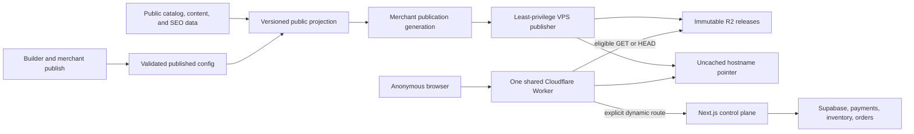

# Baci Multi-Tenant Edge Storefront Delivery Implementation Plan

> **Status:** Proposed on 2026-08-05 against `origin/main@33e8c0e80ef80891be4ac809362cf59781b758cf`. Execute each task as a separately reviewed PR unless a task explicitly says it is an operational evidence step. This plan does not authorize production mutations, Cloudflare provisioning, a `proxy.ts` change, or a new privileged database boundary by itself.

**Goal:** Remove eligible anonymous storefront browsing from Vercel for Baci's standard storefronts, then Ogabassey's custom theme, by publishing immutable merchant releases to R2 and serving them through one shared Cloudflare Worker. Keep checkout, accounts, payments, orders, inventory validation, quiz, repairs, and other stateful commerce operations authoritative and dynamic.

**Business outcome:** Reduce the actual Vercel invoice, not merely improve a cache-hit metric. Before infrastructure work, prove that eligible storefront browsing is a material billed cost. After rollout, prove at least 99.9% origin avoidance for eligible requests and a measured reduction in Vercel billed usage that exceeds the incremental Cloudflare cost.

**Relationship to the older plan:** [`2026-07-27-ultra-low-cost-storefront-delivery.md`](./2026-07-27-ultra-low-cost-storefront-delivery.md) remains the historical Ogabassey evidence and security design. This plan replaces its **single-merchant-first rollout decision** with a generic release plane and a standard-theme-first pilot. Reuse its implemented evidence contracts and fail-closed operational lessons; do not carry forward its assumption that other merchants remain permanently on Vercel.

## Decision Summary

1. Build one multi-tenant release plane for Baci. Do not create one Worker, bucket, server, or code deployment per merchant.
2. Pilot the deterministic standard Baci/Puck theme first because its behavior is controlled and reusable. Use a synthetic fixture before enrolling one consenting, low-risk standard-theme merchant.
3. Add Ogabassey second through a dedicated renderer adapter because it is a custom theme. Ogabassey is the high-traffic savings canary, not the architecture template.
4. Store only public, published, bounded storefront data in immutable release objects. Drafts, customer data, credentials, private inventory controls, and provider responses never enter R2.
5. Serve known anonymous `GET`/`HEAD` browsing routes at the edge. Forward only explicitly classified dynamic routes to the unchanged application with method, body, query, cookies, `Origin`, and CSRF semantics preserved.
6. Keep the current Vercel/Supabase commerce control plane during the release-plane rollout. Decide whether remaining dynamic workloads move to the VPS or AWS only after the post-rollout bill shows what remains.
7. Do not set the whole Next.js application to `output: 'export'`. Next.js static export does not support request-dependent cookies, Proxy, rewrites, ISR, or Server Actions. Build a dedicated deterministic release renderer for the eligible route set instead.
8. Use Cloudflare for SaaS for merchant custom-hostname/TLS onboarding when the exact-host pilots are proven. Do not adopt Workers for Platforms unless Baci later permits merchants to execute arbitrary custom code; one shared trusted Worker is sufficient for the current product.

## Current PR and Mainline Impact

| Change | Effect on this plan | Required response |
| --- | --- | --- |
| Open PR #3279, provider-neutral builder editing | Compatible. It changes how a merchant produces a validated builder edit, not where published storefront traffic runs. | Publisher reads the persisted, validated `page_configs.published_config`; it never accepts an AI/provider response as a release input. A draft AI edit causes no release until the merchant publishes it. |
| Open PR #3280, guarded Vercel attestation bootstrap | Compatible and not a release-plane dependency. It is stacked on #3279, disabled by default, production-only, and temporary. | Exclude the bootstrap route and all attestation secrets from static output. Complete its documented cleanup independently; do not treat it as permanent storefront runtime. |
| Merged PR #3266, deterministic curated defaults | Direct foundation for the standard-theme pilot. | Reuse `storefront-defaults` as the canonical fallback when a standard merchant has no custom published homepage. |
| Merged PR #3269, SEO/canonical parity | Adds mandatory release acceptance behavior. | Release output must match canonical, robots, sitemap, metadata, structured-data, and public-image eligibility contracts. |
| Merged PR #3260, unsafe storefront path rejection | Defines security and canonicalization behavior that the Worker must not contradict. | Create one shared, testable edge route contract and prove parity with current path behavior. Do not modify `apps/web/src/proxy.ts` without fresh explicit approval. |
| Merged PR #3282, production live quiz | Confirms that quiz is live, authenticated, and time-sensitive. | Keep `/quiz` and every `/api/quiz/**` request on the dynamic control plane. |
| Merged PR #3274, storefront order schema repair | Confirms order creation is database-authoritative. | Checkout and order creation always reach the current backend and recompute price, stock, promotion, shipping, tax, and final amount. |
| Merged PR #3250, Ogabassey origin contract | Provides reusable evidence and origin-budget primitives. | Generalize the manifest inventory to a cohort/merchant scope while preserving exact traffic partitions and fail-closed `NOT_PROVEN`. |
| GIGL/VPS cron cost work, including PR #3275 | Orthogonal and compatible. | Treat it as background-runtime savings; do not couple it to storefront release serving or expand its database authority. |

**Conclusion:** #3279 and #3280 do not block, invalidate, or materially overlap the edge-delivery architecture. Recent mainline work does affect the implementation contract: #3266 is the standard-theme source, while #3269, #3260, #3282, and #3274 define hard parity and dynamic-boundary requirements.

## Target Architecture



### Release layout

Use one production bucket with tenant-separated immutable keys:

```text
hosts/{normalized-hostname}.json
merchants/{merchant-id}/releases/{release-id}/manifest.json
merchants/{merchant-id}/releases/{release-id}/pages/{route-hash}.html
merchants/{merchant-id}/releases/{release-id}/assets/{content-hash}.{ext}
merchants/{merchant-id}/releases/{release-id}/data/search.json
renderers/{renderer-version}/assets/{content-hash}.{ext}
```

- A hostname pointer contains `schemaVersion`, normalized hostname, merchant ID, mode (`origin`, `edge`, or `disabled`), monotonically increasing publication generation, immutable release ID, manifest key/hash, and activation time.
- Release IDs and object keys are immutable. A publisher uploads and reads back every object, then the manifest, and commits the pointer last with compare-and-swap generation fencing.
- Renderer CSS/JavaScript/font assets are immutable and shared across compatible merchant releases. Merchant-specific generated assets stay inside the merchant namespace.
- The pointer bypasses CDN caching. Immutable release objects receive long edge caching. This uses R2's strong read-after-write consistency without pretending the CDN cache is strongly consistent.
- The public Worker has no Supabase, payment, AI, email, R2 write, or service-role credential. Prefer a public, read-only R2 custom-domain fetch path plus strict raw-origin headers over a read/write R2 binding in the serving Worker.
- Missing, malformed, or cross-tenant pointers do not silently flood Vercel. They return a bounded edge error and alert. Origin rollback is an explicit pointer mode change or exact route detachment.

### Publication input

The release builder consumes a versioned `StorefrontPublicProjection`, not live component queries:

- merchant public identity, hostname, published status, brand and theme tokens;
- validated `page_configs.published_config`, or the deterministic curated default from `apps/web/src/lib/storefront-defaults/`;
- published products, variants needed for display, categories, public media, blog/content pages, policies, reviews aggregate, and SEO decisions;
- public feature flags that affect rendered output; and
- no draft data, customer data, credentials, provider payloads, signed URLs, internal stock controls, or unpublished records.

The projection is provider-neutral. Cerebras, Groq, OpenRouter, or any later AI provider can propose builder changes, but only the persisted merchant-approved publication becomes release input.

### Route contract

The route classifier returns exactly one decision:

- `edge_release`: known public browsing `GET`/`HEAD` route with a release object;
- `edge_redirect`: canonicalization or allowlisted tracking-query removal that does not require origin;
- `origin_dynamic`: an explicitly listed stateful/machine route and allowed method; or
- `edge_terminal`: unknown path, unsupported method, malformed encoding, or disallowed query.

Initial edge-eligible routes include homepage, category/listing pages, PDPs, public content/policies, published blog pages, `robots.txt`, sitemaps, favicon, and the release 404. Search, cart, wishlist, reviews, and other ambiguous routes remain dynamic until their behavior is independently made snapshot-safe.

Always dynamic in the first release:

- every explicitly allowed non-`GET`/`HEAD` request; unknown mutation paths and unsupported methods terminate at the edge;
- `/api/**`, callbacks, webhooks, and machine endpoints;
- checkout, order success, order tracking, wallet, receipts, savings, negotiation, and payment flows;
- account, authentication, customer profile, and address flows;
- quiz, repair, IMEI, member-status, swap, and unlock flows; and
- draft preview, builder/dashboard, and any request whose response depends on cookies or private state.

Known static routes do not become origin-bound merely because they contain cookies or tracking parameters. Unknown routes for an enrolled edge hostname receive the immutable release 404; they do not fall through to Vercel. Released links use ordinary document navigation rather than depending on Next.js RSC/prefetch requests.

## Success and Stop Gates

### Business gate

Before Task 2 starts, collect a sealed seven-day baseline from Vercel and Cloudflare and calculate:

- Vercel invocations, active CPU, provisioned memory, origin transfer, cache writes/reads, and billed amount attributable to storefront hosts and paths;
- eligible anonymous browsing requests by hostname, method, path class, status, and origin decision;
- current cost per 1,000 eligible storefront views; and
- projected Worker, R2 Class A/B, storage, log, custom-hostname, and egress costs at current traffic plus 2x headroom.

Stop this work and prioritize remaining dynamic/VPS offloads if eligible storefront browsing cannot explain at least 20% of the current Baci Vercel bill. Do not infer savings from request count alone.

Freeze and hash the hostname inventory and eligibility policy before the baseline. Any later policy expansion, contraction, or host omission invalidates the baseline/post-rollout comparison and requires a new complete window.

### Technical gate

Expansion beyond one standard merchant requires:

- at least 99.9% origin avoidance for eligible requests over a complete seven-day census;
- zero unknown or rejected-method origin attempts;
- zero cross-tenant object, pointer, hostname, cache-key, or redirect leakage;
- exact dynamic preservation of method, body, query, cookies, host, `Origin`, and CSRF behavior;
- SEO, accessibility, responsive, checkout-handoff, and visual parity for the pilot merchant;
- publication p95 freshness of five minutes or less after an accepted merchant publish/catalog generation;
- tested pointer rollback in five minutes or less without a code deployment;
- at least 80% lower Vercel invocation/compute usage for the enrolled cohort's eligible browsing after traffic normalization; and
- projected monthly net savings at least twice the incremental Cloudflare monthly cost.

If the 99.9% gate passes but the total Baci Vercel invoice does not materially fall, do not enroll more merchants until the remaining bill categories are identified.

### Fast execution order

- Run Task 0 and Task 1 in parallel; neither mutates production.
- Start Task 2 only after Task 0 returns `PROCEED` and Task 1's schemas are stable.
- Task 5 may build against fixtures while Task 3 and Task 4 build the production ledger/publisher, but Task 6 requires all three.
- Tasks 7-10 are sequential operational gates. Do not hide a failed standard pilot by jumping directly to Ogabassey.
- Rebase every implementation PR onto current `main`. If #3279 merges before Task 2, run its builder-catalog and theme compatibility tests against the release projection. If it merges later, #3279 must pass the release-projection tests before it can publish a new component shape. #3280 has no renderer dependency.

## Implementation Tasks

### Task 0: Seal the Current Cost and Traffic Contract

**Files:**

- Modify: `packages/shared/src/storefront/delivery-evidence*.ts`
- Modify: `apps/web/tools/cost/storefront-origin-budget*.ts`
- Create: `apps/web/tools/cost/storefront-cohort-cost-baseline.ts`
- Create: `apps/web/tools/cost/storefront-cohort-cost-baseline.test.ts`
- Modify: `docs/ops/storefront-origin-budget.md`

- [ ] Parameterize the existing Ogabassey evidence manifest with an explicit cohort ID and complete hostname inventory while preserving exact per-host/method/path-class/rule reconciliation.
- [ ] Add Vercel billed-unit inputs and Cloudflare incremental-cost inputs; keep credentials and raw URLs out of artifacts.
- [ ] Make missing, sampled, stale, unauthenticated, or unreconciled inputs produce `NOT_PROVEN`, never `PASS`.
- [ ] Capture an authenticated seven-day production baseline as a non-executable evidence artifact after the tooling PR merges.
- [ ] Record a `PROCEED` or `STOP` business decision using the 20% bill-attribution gate.

**Validation:**

```bash
pnpm --filter @baci/shared test
pnpm --filter @baci/web test -- storefront-origin-budget storefront-cohort-cost-baseline
pnpm --filter @baci/shared typecheck
pnpm --filter @baci/web typecheck:tools-workers
```

### Task 1: Define Shared Release, Projection, and Route Contracts

**Files:**

- Create: `packages/shared/src/storefront-release/release-manifest-schema.ts`
- Create: `packages/shared/src/storefront-release/release-manifest-schema.test.ts`
- Create: `packages/shared/src/storefront-release/hostname-pointer-schema.ts`
- Create: `packages/shared/src/storefront-release/hostname-pointer-schema.test.ts`
- Create: `packages/shared/src/storefront-release/public-projection-schema.ts`
- Create: `packages/shared/src/storefront-release/public-projection-schema.test.ts`
- Create: `packages/shared/src/storefront-release/classify-storefront-edge-request.ts`
- Create: `packages/shared/src/storefront-release/classify-storefront-edge-request.test.ts`
- Create: `apps/web/src/lib/storefront-release/storefront-edge-route-parity.test.ts`

- [ ] Define strict, versioned Zod schemas with bounded route counts, object sizes, aggregate release bytes, path lengths, content types, and hashes.
- [ ] Normalize hostnames, routes, and queries once; reject encoded separators, dot segments, control characters, unsupported Unicode ambiguity, cross-tenant keys, and JavaScript-number generation overflow.
- [ ] Encode the static/dynamic/terminal matrix above as data and pure functions, not Worker-only string checks.
- [ ] Add parity tests against current storefront route and path-safety behavior, including the #3260 over-encoding cases.
- [ ] Keep `apps/web/src/proxy.ts` unchanged. If parity cannot be achieved without changing it, stop for explicit owner approval and isolate that change in its own PR.

### Task 2: Build the Deterministic Standard-Theme Release Renderer

**Files:**

- Create: `apps/web/src/lib/storefront-release/load-storefront-public-projection.ts`
- Create: `apps/web/src/lib/storefront-release/load-storefront-public-projection.test.ts`
- Create: `apps/web/src/lib/storefront-release/build-standard-storefront-release.ts`
- Create: `apps/web/src/lib/storefront-release/build-standard-storefront-release.test.ts`
- Create: `apps/web/src/components/storefront-release/render-standard-puck-release.tsx`
- Create: `apps/web/src/components/storefront-release/render-standard-puck-release.test.tsx`
- Modify only as adapters: `apps/web/src/lib/storefront-defaults/*`
- Reuse acceptance behavior from: `apps/web/src/app/(storefront)/[slug]/**`

- [ ] Load one transactionally coherent public projection using explicit columns and tenant predicates; never use `select('*')`.
- [ ] Validate `published_config` against the closed builder component catalog. Reject unknown components, arbitrary HTML/JS, external code, private URLs, and unbounded props.
- [ ] Use #3266 curated defaults only when no merchant-published standard configuration exists.
- [ ] Render deterministic HTML, CSS, minimal executable assets, metadata, JSON-LD, canonical links, public catalog pages, content, sitemaps, robots, and a real 404 without request-time Supabase or Vercel dependencies.
- [ ] Render through a bounded library/CLI call; never run a full `next build`, create a Vercel deployment, or compile a separate application per merchant or publication generation.
- [ ] Emit a route-dependency index so a product/category/content mutation rebuilds only affected pages when the prior manifest uses the same renderer version. Fall back to a bounded full release when dependency compatibility is unknown.
- [ ] Ensure Puck components that currently fetch at runtime receive release projection data instead. Do not serialize live Supabase calls into the browser.
- [ ] Match #3269 canonical/indexing decisions and preserve accessible landmarks, product links, image dimensions, responsive behavior, and checkout/cart handoff URLs.
- [ ] Emit no `/_next/image`, `/_next/static`, Vercel Analytics, or request-time image-optimization dependency. Use approved public media-CDN URLs or content-addressed release derivatives with explicit dimensions.
- [ ] Prove byte-for-byte determinism for the same projection and renderer version.

**Validation:**

```bash
pnpm --filter @baci/web test -- storefront-release storefront-defaults
pnpm --filter @baci/web lint
pnpm --filter @baci/web typecheck
```

### Task 3: Add a Transactional Publication Generation and Release Ledger

**Approval gate:** This task adds migrations and a new machine capability. Obtain owner/security approval for the exact tables, RPCs, grants, caller identity, and VPS credential before implementation. Existing migrations remain append-only.

**Files:**

- Create: `supabase/migrations/<timestamp>_storefront_release_ledger.sql`
- Create: `supabase/tests/storefront_release_ledger.sql`
- Create: `apps/web/src/schemas/storefront-release-job.ts`
- Create: `apps/web/src/schemas/storefront-release-job.test.ts`
- Modify through a new append-only migration: cache-invalidation enqueue functions/triggers
- Modify: database replay manifests required by repository checks

- [ ] Create one coalescing pending generation per merchant and immutable release rows with `queued`, `claimed`, `building`, `objects_verified`, `pointer_committed`, `active`, `failed`, `retired`, and `deleted` transitions.
- [ ] Fence claims by generation, lease, and random claim token. A stale worker cannot activate or complete a later generation.
- [ ] Extend the central public-output invalidation/enqueue boundary so every committed change that affects a release also bumps the merchant publication generation in the same transaction.
- [ ] Audit all public-output dependencies: published builder config, merchant identity/domain/theme, products/variants/offers, categories, media, blogs/pages/policies, public features, SEO settings, and deletion.
- [ ] Keep the VPS free of `SUPABASE_SERVICE_ROLE_KEY` and a broad database login. Expose only reviewed claim/read/complete/fail RPC capability, and prove the credential cannot call unrelated `PUBLIC` functions, spoof trusted claims, or read private tables.
- [ ] Make merchant deletion/takedown win over publication and prevent an older release from being reactivated.

### Task 4: Build the Least-Privilege VPS Publisher and R2 Reconciler

**Files:**

- Create: `apps/web/src/scripts/process-storefront-releases.ts`
- Create: `apps/web/src/scripts/process-storefront-releases.test.ts`
- Create: `apps/web/src/lib/storefront-release/publish-storefront-release.ts`
- Create: `apps/web/src/lib/storefront-release/publish-storefront-release.test.ts`
- Create: `apps/web/src/lib/storefront-release/reconcile-storefront-release.ts`
- Create: `apps/web/src/lib/storefront-release/reconcile-storefront-release.test.ts`
- Create: `vps-workers/bin/process-storefront-releases.sh`
- Modify: `vps-workers/deploy.sh`
- Modify: `vps-workers/jobs/preflight-direct-web-workers.mjs`
- Modify: `docs/ops/vps-workers.md`

- [ ] Use a bucket-scoped Cloudflare credential available only to the publisher process; start it with an allowlisted environment and no AI/payment/email/service-role secrets.
- [ ] Claim and coalesce a merchant generation, build its projection/release, upload content-addressed objects, verify metadata and hashes, upload/read back the manifest, then compare-and-swap the hostname pointer.
- [ ] Reuse unchanged content-addressed pages and shared renderer assets across releases. A burst of catalog events coalesces to the latest generation rather than producing one full release per event.
- [ ] Make every step idempotent. A timeout or crash enters read-only reconciliation before any write is retried.
- [ ] Preserve the active release plus at least two verified rollback releases. Garbage collection never deletes a pointer target, live build, deletion proof, or protected rollback.
- [ ] Install one `flock`-guarded worker schedule with bounded batch, deadline, retry/backoff, dead-letter alerting, release SHA verification, and readiness smoke.
- [ ] Do not remove any current Vercel path or route in this task.

### Task 5: Implement One Shared Cloudflare Serving Worker

**Files:**

- Create: `apps/storefront-edge/package.json`
- Create: `apps/storefront-edge/wrangler.jsonc`
- Create: `apps/storefront-edge/src/index.ts`
- Create: focused modules and colocated tests under `apps/storefront-edge/src/`
- Modify: root workspace/Turbo configuration only as required
- Create: `docs/ops/storefront-edge.md`

- [ ] Parse and validate the request hostname before pointer lookup. Only an exact enrolled hostname can select a pointer.
- [ ] Import the shared route classifier; define no second method/path vocabulary in Worker code.
- [ ] Fetch the uncached pointer, validate tenant/release binding and manifest hash, then serve only manifest-listed immutable objects.
- [ ] Use cache keys containing hostname, merchant ID, release ID, route, encoding, and content variant. Never vary release HTML by cookies or unbounded query strings.
- [ ] Preserve `HEAD`, conditional requests, range behavior for approved assets, content type, CSP, HSTS, robots, canonical headers, and a bounded release 404.
- [ ] Forward only `origin_dynamic` requests through a tested same-host origin mechanism that cannot recurse and preserves host, method, body, headers, cookies, query, and `Origin`.
- [ ] Return edge `404`, `405`, or `400` for terminal decisions without origin access. Pointer/manifest failure returns a bounded `503` and alert, not automatic origin fallback.
- [ ] Emit privacy-bounded decision counters compatible with the existing delivery-evidence schema; never log raw URLs, queries, cookies, tokens, customer identifiers, or bodies.
- [ ] Disable `workers.dev` in production. Configure raw R2 origin headers as `noindex` and protect pointer paths from cache.

**Validation:**

```bash
pnpm --filter @baci/shared test
pnpm --filter @baci/storefront-edge test
pnpm --filter @baci/storefront-edge lint
pnpm --filter @baci/storefront-edge typecheck
pnpm turbo lint typecheck test
```

### Task 6: Prove a Synthetic Standard Store Without Production Routing

- [ ] Generate a bounded fixture merchant using the curated standard theme, products, categories, policies, blog, and SEO cases.
- [ ] Publish it to a non-production bucket/hostname and test with the real Worker runtime, not a Node-only mock.
- [ ] Compare origin and release outputs for route inventory, status, canonical/robots/sitemap/JSON-LD, security headers, accessibility, responsive screenshots, links, image behavior, and 404s.
- [ ] Exercise malformed hosts, cross-tenant object keys, over-encoded paths, traversal, tracking queries, RSC/prefetch headers, unsupported methods, stale pointers, partial uploads, and pointer rollback.
- [ ] Prove dynamic handoff for checkout/account/quiz/order/repair paths with cookies and CSRF; use mocks or isolated test systems, never real payments or customer data.
- [ ] Load-test at 2x observed peak and prove Worker/R2/log capacity and cost headroom.

### Task 7: Canary One Real Standard-Theme Merchant

**Operational approval gate:** Require merchant consent, exact hostname inventory, production token readback, owner approval, green exact-head CI/review, and tested rollback before routing traffic.

- [ ] Enroll one low-risk standard-theme Baci subdomain through an exact hostname route; do not use `*.usebaci.com` for the pilot.
- [ ] Publish and owner-review the exact candidate release before traffic.
- [ ] Roll out `1% -> 10% -> 50% -> 100%` with reviewed Cloudflare version weights or an equivalently deterministic, privacy-safe cohort mechanism and a hold at each step. Freeze or roll back on correctness, origin, cost, error, or performance regression.
- [ ] Keep custom domains outside this first canary. Keep all non-enrolled hosts on the current path.
- [ ] Run a complete seven-day 100% window and seal the technical/business gate evidence.

### Task 8: Expand the Standard Multi-Tenant Plane

- [ ] Enroll a small standard-theme cohort by exact hostname, then expand only after each seven-day gate.
- [ ] Add automated hostname enrollment, ownership validation, certificate status, pointer creation, takedown, and deletion workflows.
- [ ] Introduce Cloudflare for SaaS for merchant custom hostnames and TLS after Baci subdomain proof. Preserve zero-downtime validation and a per-host origin rollback.
- [ ] Add quotas for release bytes, routes, products, media references, builds/hour, retained releases, and log volume so free merchants cannot create unbounded infrastructure cost.
- [ ] Maintain one shared Worker deployment and one release schema. Merchant data changes create releases; they do not deploy Worker code.

### Task 9: Add the Ogabassey Custom-Theme Adapter

**Files:**

- Create: `apps/web/src/lib/storefront-release/build-ogabassey-storefront-release.ts`
- Create: `apps/web/src/lib/storefront-release/build-ogabassey-storefront-release.test.ts`
- Reuse parity behavior from: `apps/web/src/app/(storefront)/[slug]/(home)/ogabassey-static-home-page.tsx`
- Reuse evidence tools from: `apps/web/tools/cost/ogabassey-*` and `packages/shared/src/storefront/delivery-evidence*`

- [ ] Treat Ogabassey as an adapter over the same projection, release manifest, pointer, publisher, Worker, rollback, and evidence contracts.
- [ ] Inventory its additional listing/PDP/blog/content/repair/IMEI and custom-theme behavior; only public snapshot-safe routes enter the release.
- [ ] Preserve dynamic commerce/utility boundaries and all Ogabassey SEO/CWV contracts.
- [ ] Run preview parity, owner acceptance, exact-host rollout, rollback drills, and a seven-day 100% evidence window.
- [ ] Compare the actual Baci Vercel invoice before and after Ogabassey. This is the first high-traffic proof of significant savings.

### Task 10: Decide the Remaining Runtime Migration From Evidence

- [ ] Re-run the Vercel cost attribution after the standard cohort and Ogabassey are fully measured.
- [ ] Rank remaining billed workloads: dynamic storefront APIs, dashboard SSR/API, image optimization, crons, queues, AI, webhooks, and build/deploy infrastructure.
- [ ] Keep Vercel if the remaining dynamic cost is small enough and operationally justified.
- [ ] Move bounded background jobs to the existing VPS where least privilege, redundancy, and observability are already proven.
- [ ] Create a separate AWS/VPS control-plane migration ADR only if measured monthly savings exceed infrastructure plus operational risk. Do not migrate the full Next.js runtime merely to complete an architectural story.

## Rollout PR Boundaries

1. Evidence/baseline tooling.
2. Shared schemas and route contract.
3. Standard renderer and parity fixtures.
4. Release ledger migration and narrow authority.
5. VPS publisher/reconciler.
6. Shared Worker implementation and non-production topology.
7. Synthetic preview evidence.
8. Standard merchant canary operations plus a separate evidence-only PR.
9. Multi-tenant/custom-hostname enrollment.
10. Ogabassey adapter and canary operations plus a separate evidence-only PR.

Never combine a privileged migration, provider control-plane mutation, Worker code, and production cutover in one unreviewable PR.

## Rollback and Failure Policy

- **Bad content but healthy Worker:** compare-and-swap the pointer to the last verified release.
- **Worker or routing fault:** set the exact hostname to explicit `origin` mode or detach its exact route; never wait for a code deployment.
- **Pointer/manifest corruption:** edge `503`, alert, and reconcile. Do not automatically send unbounded traffic to Vercel.
- **Publisher outage:** continue serving the last active immutable release; alert when freshness exceeds five minutes. Checkout still validates authoritative current state.
- **Deletion/takedown:** publish a terminal disabled pointer and detach hostname routing before asynchronous object cleanup. Cached objects are purged and retention cleanup is proven separately.
- **Cost anomaly:** freeze enrollment and promotion. Route removal is preferable to allowing a Worker limit or log bill to become the rollback mechanism.

## Definition of Done

- [ ] The current Vercel bill attribution proves this work is worth doing.
- [ ] A standard merchant and Ogabassey both serve eligible anonymous browsing from the same Worker/release plane.
- [ ] Seven complete days show at least 99.9% eligible origin avoidance with zero unknown/rejected origin attempts.
- [ ] The enrolled cohort shows at least 80% lower normalized Vercel browse runtime and at least 2x net savings over incremental Cloudflare cost.
- [ ] Dynamic checkout, payment, order, inventory, account, quiz, repair, and other stateful flows retain current authority and security.
- [ ] SEO, accessibility, responsive UI, performance, path safety, and custom-domain behavior pass parity gates.
- [ ] Publication is durable, idempotent, generation-fenced, observable, and fresh within five minutes at p95.
- [ ] Rollback works in five minutes or less without a code deployment.
- [ ] No serving Worker has privileged credentials; no release contains private/draft/customer/credential data.
- [ ] Merchant deletion/takedown prevents old release reactivation and completes cache/object cleanup within the approved lifecycle SLA.
- [ ] A post-rollout cost report identifies whether any AWS/VPS control-plane migration is still economically justified.

## Current Platform References

- [Cloudflare R2 consistency model](https://developers.cloudflare.com/r2/reference/consistency/) — R2 object operations are strongly consistent, while CDN-cached access can remain stale; therefore use immutable release objects and an uncached pointer.
- [Cloudflare for SaaS](https://developers.cloudflare.com/cloudflare-for-platforms/cloudflare-for-saas/) — the intended later mechanism for customer custom hostnames, TLS, and SaaS routing.
- [Cloudflare Workers for Platforms](https://developers.cloudflare.com/cloudflare-for-platforms/workers-for-platforms/) — reserve for a future requirement to run isolated merchant-authored code, not ordinary theme/data selection.
- [Next.js static exports](https://nextjs.org/docs/app/guides/static-exports) — supports static HTML/assets but excludes request-dependent and server-runtime features, which is why this plan uses a bounded release renderer rather than exporting the whole app.
